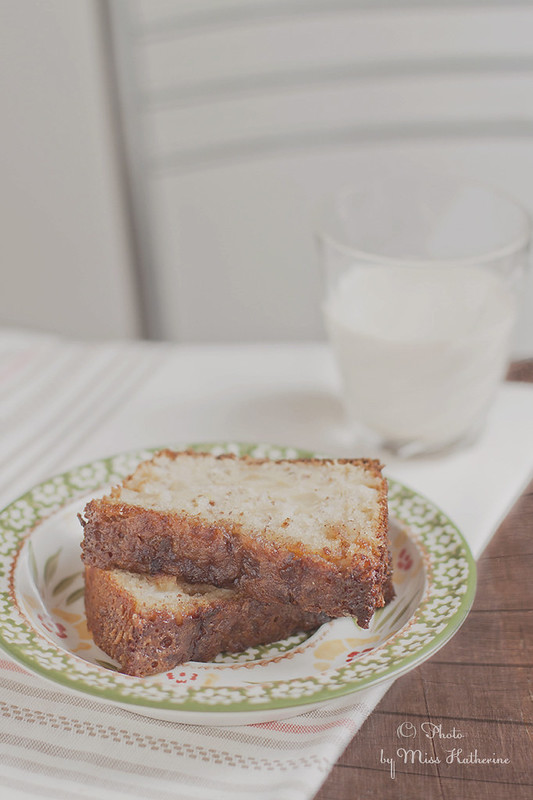

# Яблочный кекс с крустильяном

#### Ингредиенты:

на форму 24-26 см

* 100 г муки
* 1 ч.л. разрыхлителя
* 25 г молотого миндаля
* 1 яйцо
* 70 г сахара
* 50 мл молока
* 4 ст.л. оливкового масла
* 2 яблока
* щепотка соли

**для крустильяна:**

* 50 г сливочного масла
* 50 г сахара
* 1 яйцо
* 1/4 ч.л. молотой корицы

#### Приготовление:

Духовку нагреть до 180 градусов.

В глубокой миске яйцо растереть с сахаром.Влить оливковое мало и молоко, добавить шепотку соли и перемешивать, добавляя порциями муку и молотый миндаль. Яблоки вымыть, очистить, нарезать кубиками и подмешать в тесто. Выложить тесто в смазанную маслом и присыпанную мукой форму и выпекать 25 минут.

Приготовить крустильян. В кастрюле с толстым дном сливочное масло растопить с сахаром. Кастрюлю снять с огня и дать смеси немного остыть. Добавить корицу, яйцо и хорошо взбить.
Вылить приготовлению смесь на кекс, увеличить температуру духовки до 240 градусов и готовить кекс с крустильяном 8 минут.

Достать из духовки, дать остыть в форме

*https://miss-katherine.livejournal.com/135971.html*
