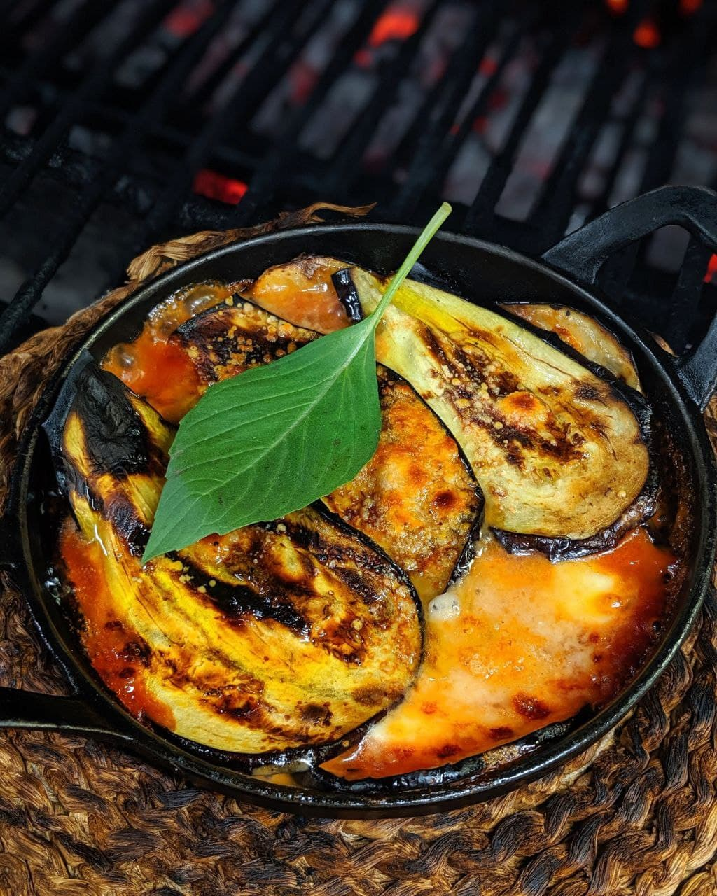

# Баклажаны под сыром

#### Ингредиенты

* баклажаны
* тёртый сыр (моцарелла, чеддер)
* итальянский томатный соус
* чеснок
* базилик свежий

#### Приготовление

Духовку разогреть до 250C.
Проварить соус с базиликом, мелко порезанным чесноком, солью и перцем минут 15. Добавить чуть сахара, если вдруг кисло.
Баклажаны нарезать вдоль или поперек, толщиной 3-5 мм. Смазать оливковым маслом и мелкой солью, на рифлёной сковороде жарить до готовности.
В стеклянную, керамическую или чугунную посуду выложить на дно слой за слоем сыр, томатный соус, баклажаны, последним слоем сыр.
Запечь в духовке или в закрытом гриле.

*@ElCaminoBCN*
