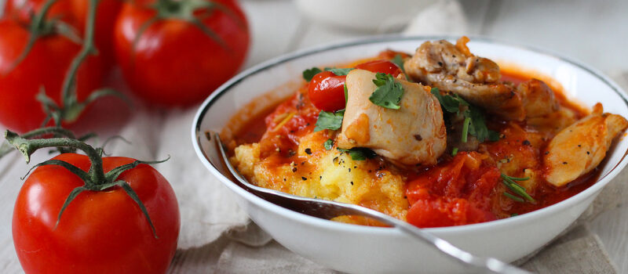

# Žgvacet od kokoši/ Жгвацет из курицы по-истрийски

#### Ингредиенты

* Куриные бедра (филе) около 800 г
* Чеснок 3 дольки
* Пелати 500 г
* Белое сухое вино 200 мл
* Тимьян пара веточек
* Розмарин пара веточек
* Соль по вкусу
* Перец по вкусу
* Оливковое масло для жарки

#### Приготовление

Нарезать филе крупными кусками. Разогреть масло и зарумянить мясо со всех сторон.  
Почистить и раздавить чеснок, добавите в сковороду.  
Добавить травы и пелати, подсолить, поперчить, влить вино и около 100 мл воды.  
Готовить на среднем огне примерно полчаса, чтобы мясо стало нежным, а соус загустел.

*vinegrette.ru*
