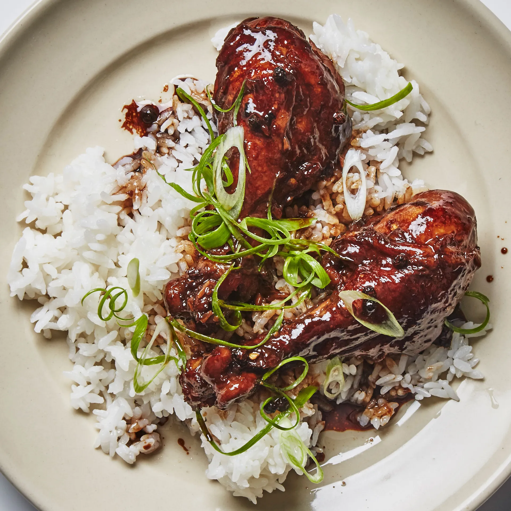

---
image: ../pics/adobo.webp
---
# Адобо

Филиппинский цыпленок адобо — национальное блюдо Филиппин, и, как и все традиционные блюда, существует множество вариаций, например свинина и говядина.

По сути, ключевыми ингредиентами являются правильный баланс соевого соуса, уксуса, черного перца и сахара, которые создают липкую глазурь с глубоким вкусом.

#### Ингредиенты

4 порции

* 8 бедер без кожи и костей (не грудка, тк нужен жир)
* 6-8 зубчиков чеснока, крупно нарезанные
  
**для маринада:**

* 3 Тайские чили, разрезанные вдоль пополам
* 1 4 см кусочек имбиря
* 1 чашка рисового уксуса
* ¾ чашки соевого соуса (не темного)
* 2 ст л черного перца горошком
* 2 ложки пальмового сахара или светло-коричневого сахара
* 3 лавровый лист

#### Приготовление

Смешать ингредиенты для маринада в миске. Мариновать курицу не менее 1 часа или до ночи.
Нагреть растительное масло в сковороде на сильном огне, достать курицу из маринада (оставьте маринад) и выложить в сковороду. Обжарить с обеих сторон до румяной корочки – примерно по 1 минуте с каждой стороны. Не готовить курицу до конца.

Нагреть на сковороде масло, обжарить чеснок около минуты. Добавить маринад и ½ стакана воды, довести до кипения, затем накрыть крышкой и тушить на медленном огне 20 минут. Снять крышку, перевернуть курицу и тушить, время от времени переворачивая курицу и при необходимости регулируя огонь, пока мясо не станет очень нежным, а жидкость не выпарится и не начнет выпариваться, а соус глазируется, около 25 минут.  
Если соус недостаточно густой, переложить курицу на тарелку и дать соусу закипеть — он загустеет гораздо быстрее, — затем вернуть курицу в сковороду, чтобы она покрылась глазурью.

Покрыть курицу глазурью и подавать с рисом.

*bonappetit.com/*
