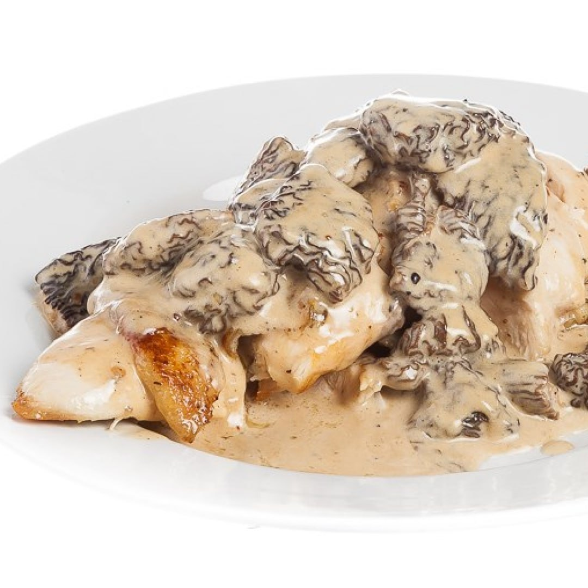

---
image: ../pics/photo_2024-05-22_12-14-27.jpg
---
# Куриная грудка со сморчками и сливочно-хересным соусом

#### Ингредиенты
1 порция

* Куриное филе: 2 штуки
* Сморчки: 200 г
* Лук-шалот: 2 головки
* Херес: 200 мл
* Сливки 35%-ные: 100 мл
* Чеснок: 5 зубчиков
* Растительное масло: 2 столовые ложки
* Тимьян: 1 пучок
* Лавровый лист: 3 штуки
* Молотый кориандр : 1 столовая ложка
* Розмарин: по вкусу
* Орегано: по вкусу
* Сливочное масло: 25 г
* Соль и перец: по вкусу

#### Приготовление

Куриные грудки (с кожей) залить двумя литрами воды, добавить 3 зубчика чеснока, почти весь тимьян, кориандр, розмарин и орегано и поставить на огонь, довести почти до кипения, убавить огонь и готовить 15-20 минут.

В это время приготовить соус. Лук-шалот нарезать тонкими кольцами. Раздавить зубчик чеснока. Отрезать ножки сморчков до уровня шляпок. На сковороде нагреть растительное масло, добавить лук и чеснок. Жарить почти до золотистой корочки. Примерно в середине процесса добавить ножки сморчков. В конце влить херес (или мадеру, или сухой портвейн). Выпарить его. Добавить немного бульона из кастрюли с варящейся курицей, выпарить. Влить сливки и готовить минут пять на небольшом огне. Затем процедить.

Шляпки сморчков слегка обжарить на отдельной сковороде на растительном масле. Добавить к соусу, перемешать и готовить до нужной вам густоты соуса. Посолить, поперчить.

Снять куриное мясо с кости, разделив его на два филе. Обжарить на растительном масле сначала кожей вниз до румяной корочки, затем перевернуть, добавить сливочное (или топленое) масло, три ветки тимьяна и раздавленный зубчик чеснока. Готовить, регулярно поливая горячим маслом, до готовности.

*eda.ru*
