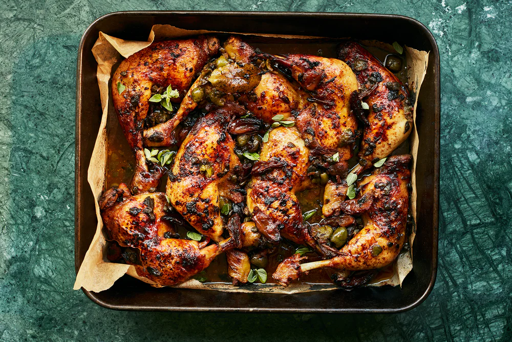

---
image: ../pics/chicken-dates.jpg
---
# Куриные бедра запеченные с финиками, оливками и каперсами

#### Ингредиенты

на 4 порции

* 8 куриных ног с бедром на 2 кг
* сухое белое вино 120 мл
* финиковый сироп или меласса 1 ст л

**для маринада:**

* 5 зубчиков чеснока
* свежее орегано 15 г
* красный винный уксус 3 ст л
* оливковое масло 3 ст л
* зеленые оливки без косточки 100 г
* каперсы 60 г
* финики без косточки 70 г
* 2 лавровых листа
* соль ¾ ч л
* перец по вкусу

#### Приготовление

Финики разрезать вдоль на четвертинки, чеснок раздавить. Курицу выложить в миску, добавить все ингредиенты маринада, хорошо перемешать, оставить в холодильнике мариноваться на пару дней периодически помешивая.

Разогреть духовку до 180С с конвекцией. Выложить курицу на противень вместе с маринадом. Вино и сироп смешать, полить мясо. Запекать 50 минут до золотистой корочки, в процессе полить маринадом 2-3 раза.

Подавать украсив свежим орегано.

*Ottolenghi*
