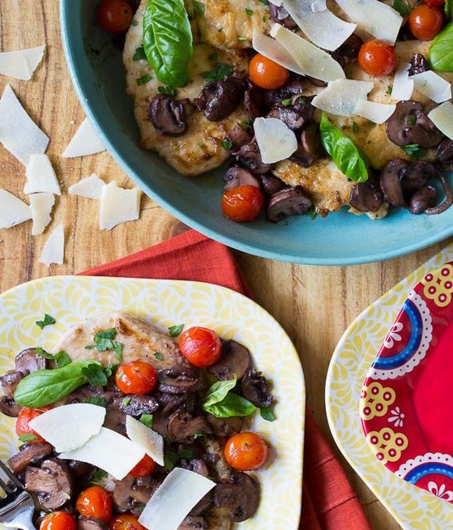

---
image: ../pics/chicken-marsala.jpg
---
# Курица с помидорами и базиликом в соусе из марсалы

#### Ингредиенты

4 порции \| 40 минут

* куриная грудка 450 г
* цельнозерновая мука 30 г
* сливочное масло 0.5 ст л
* оливковое масло 0.5 ст л
* помидоры черри 300 г
* чеснок 3 зубчика
* грибы 450 г
* Марсала 100 мл
* свежая петрушка 15 г
* свежий базилик 10 г
* тертый пармезан для подачи 20 г
* соль, перец по вкусу

#### Приготовление

Разрезать каждую куриную грудку на 3 плоские котлеты, поместить в полиэтиленовую пленку и отбить. Смешать муку с солью и перцем. Обвалять куриные котлеты в муке.

Разогреть большую сковороду на среднем огне. Добавить сливочное и оливковое масла в сковороду. Обжарить курицу по 2-3 минуты с каждой стороны, отложить на тарелку.

Обжаривать помидоры черри пока они не начнут лопаться, отложить на тарелку.

Нарезать грибы, раздавить чеснок, обжарить их до мягкости. Затем добавить вино Марсала и бульон. Готовить пока большая часть жидкости не впитается. Вернуть курицу и помидоры обратно в сковороду и перемешать. Снять с огня и добавить нарезанную зелень.

Подавать теплым с сыром пармезан.

*aspicyperspective.com*
