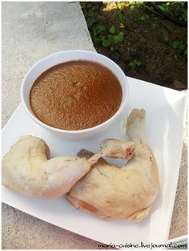

---
image: ../pics/chicken-mole.jpg
---
# Курица в шоколадном соусе \| Chicken Mole

_блюдо на любителя. На большого любителя..._

#### Ингредиенты

* курица весом примерно 1.5-2 кг
* 2 луковицы, очистить, разрезать на 4 части
* 2 палочки корицы
* 4 зубчика чеснока, очистить
* 6 лавровых листов
* 1 ч.л. соли
* 10 горошин черного перца
* 2 стебля сельдерея, порезать произвольно

**для соуса:**

* 2 банки помидоров в собственном соку, порезанных кубиками
* 2 луковицы, мелко порубить
* 2 зубчика чеснока, нарезать тонкими ломтиками
* 100 г хорошего темного шоколада \(70%\), разломать
* 5 сушенных перца чили
* 1 ч.л. зиры
* 1 ч.л. молотой корицы
* 2 ч.л. какао-порошка
* 2 ч.л. кунжута
* 1 ч.л. соли
* красный винный уксус
* оливковое масло

Поместить курицу со всеми остальными ингредиентами для варки в большую кастрюлю. Залить водой так, чтобы она покрывала курицу на 2 см. Поставить на огонь, довести до кипения, сразу уменьшить огонь до маленького и варить при еле заметных пузырьках 1.5 часа, или пока курица не станет очень мягкой.

Пока варится курица, приготовить соус.

Чили залить кипятком и оставить постоять на 10-15 минут.

Когда чили размягчится, налить в глубокую сковородку щедрую порцию оливкового масла. Когда оно нагреется, добавить лук, чеснок, чили, зиру и корицу и тушить на медленном огне 15-20 минут, пока лук не станет мягким.

Добавить кунжут и помидоры. Промыть банки от помидор водой, в которой настаивался чили, и добавить эту воду в соус. Довести соус до кипения, сразу уменьшить огонь и варить 5 мин при еле заметном кипении. Добавить какао, соль, свежемолотый черный перец, варить еще 5 минут.

Добавить шоколад. Когда он растает, перелить соус в блендер и пробить его до однородности.

Добавить винный уксус по вкусу, соль и перец, если нужно.

Подавать соус с курицей, вареным рисом, хлебными лепешками. При желании можно снять мясо с костей.

_maria-cuisine.livejournal.com_
