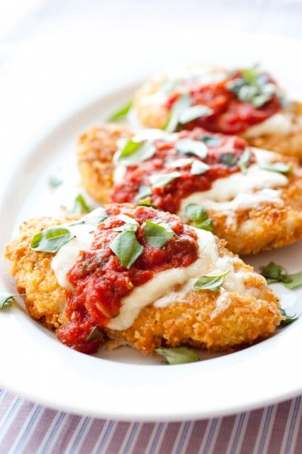

---
image: ../pics/chicken-parmesan-tomato-sauce.jpg
---
# Куриная грудка в пармезане с томатным соусом

#### Ингредиенты
3-4 порции

* 2 больших куриных грудки без кожи
* 60 г сыра моцарелла
* 60 г сыра проволоне
* 1 большое яйцо
* 1 столовая ложка муки общего назначения
* 40 г сыра пармезан
* 60 г панировочных сухарей
* 1/2 ч.л. чесночного порошка
* 1/4 ч.л. сушеного орегано
* 70 г оливкового масла
* 5 г свежего базилика

**для соуса маринара**

* 1 столовая ложка оливкового масла
* 2 зубчика чеснока
* 800 г консервированных томатов
* 1/4 ч.л. сушеной петрушки
* 1/4 ч.л. сушеного орегано
* 1/4 ч.л. красный перец хлопья
* 1/4 ч.л сахара
* 1 лавр лист; 
* 2 свежие веточки базилика
* соль и свежемолотый черный перец

#### Приготовление

Приготовить соус: разогреть 1 столовую ложку оливкового масла в средней кастрюле на среднем огне, добавить чеснок, петрушку, орегано и хлопья перца, обжарить 30 сек. Добавить измельченные помидоры, соль, сахар, 2 свежие веточки базилика, затем приправьте солью и перцем по вкусу. Довести смесь до кипения, затем уменьшить огонь до минимума и дать настояться 20 минут, периодически помешивая, пока не загустеет, снять с огня и накрыть кастрюлю крышкой.

Разрезать каждую куриную грудку на 3 плоские котлеты, поместить в полиэтиленовую пленку и отбить, посыпать каждую сторону куриной котлеты солью, оставить при комнатной температуре на 10 минут.

В отдельной тарелке смешать муку и взбитое яйцо до однородности. В другой тарелке смешать сыр пармезан, панировочные сухари, чесночный порошок, орегано и перец 1/4 ч.л.

Курицу подсушить бумажными полотенцами, затем поочередно по 1 куриной котлете обваливать в яичной смеси и в пармезане и обжарить на среднем огне до золотистого цвета. Переложить жареную курицу на противень.

Смешать моцареллу и проволоне и посыпать курицу сырной смесью. Запекать в духовке при 180 пока сыр не расплавится.

Готовую курицу подавать, полив кусочек 2 ложками соуса маринара и украсив нарезанным базиликом. Оставшийся соус смешать с пастой и подавать в качестве гарнира.

_cooksillustrated.com_

