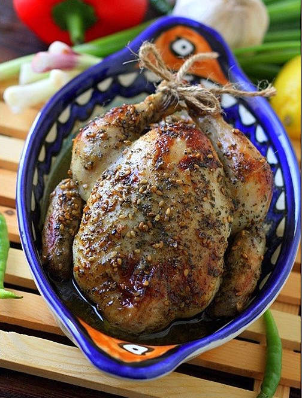

---
image: ../pics/chicken-zaatar.jpg
---
# Курица запеченная целиком с заатаром, лимоном и мятой

#### Ингредиенты

* курица 1 кг
* 1 средний лимон
* заатар 2 ст л
* оливковое масло 3 ст л
* мёд 1 ст л
* мята 1 пучок
* соль, молотый черный перец по вкусу

#### Приготовление

В миске смешать лимонный сок, заатар, оливковое масло, мёд.Курицу помыть, посолить внутри и снаружи. Мяту нарезать и положить вовнутрь курицы, связать ножки у курицы. Полить соусом курицу.Оставить на 1 час мариноваться, в процессе поливать соусом.

В огнеупорною форму для запекания положить курицу, полить маринадом, поперчить.Закрыть фольгой,запечь.

_lg: elena-fialka_
