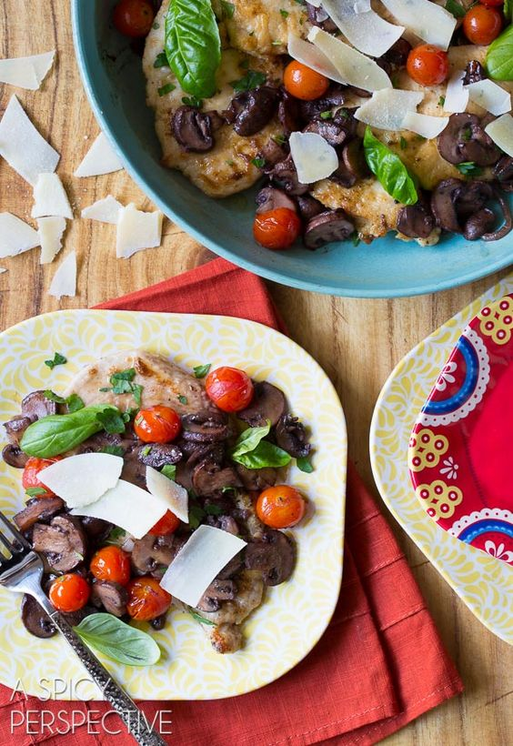

---
image: ../pics/66f154c53e53dcedc70935837fd170ea.jpg
---
# Курица с помидорами и базиликом в соусе из марсалы \| Chicken Marsala Recipe with Tomatoes and Basil

#### Ингредиенты

3-4 порции \| 40 минут

* 2 больших куриных грудки без кожи
* 1/4 чашки муки общего назначения
* 1 столовая ложка сливочного масла
* 1 столовую ложку оливкового масла
* 1 пинта помидоры черри
* 1 шалот, очищенный и нарезанный
* 3 зубчика чеснока, очищенные и фарша
* 1 фунт шампиньонов, нарезанных тонкими ломтиками
* 1/2 чашки Марсалы
* 1/4 чашки куриного бульона
* 1/4 чашки свежего нарезанной петрушки
* 1/4 чашки свежих листьев базилика
* пармезан для подачи

#### Приготовление

Разрезать каждую куриную грудку на 3 плоские котлеты, поместить в полиэтиленовую пленку и отбить. Смешать муку с 1 чайной ложки соли и 1/2 чайной ложки молотого перца. Обвалять куриные котлеты в муке.

Разогреть большую сковороду на среднем огне. Добавить 1/2 столовой ложки сливочного масла и 1/2 столовой ложки растительного масла в сковороду. Обжарить курицу по 2-3 минуты с каждой стороны .Убрать и накрыть фольгой.

Обжаривать помидоры черри пока они не начнут лопаться, убрать и накрыть фольгой.

Добавьте оставшееся сливочное масло и растительное масло в сковороду. Затем добавьте грибы, лук-шалот, чеснок. Поджарить грибы, пока они не станут мягкими. Затем добавить вино Марсала и бульон. Готовить пока большая часть жидкости не впитается. Добавьте курицу и помидоры обратно в сковороду и перемешайте. Выключите огонь и добавьте свежих листьев базилика и петрушки.

Подавать теплым с сыром пармезан.

*aspicyperspective.com*
