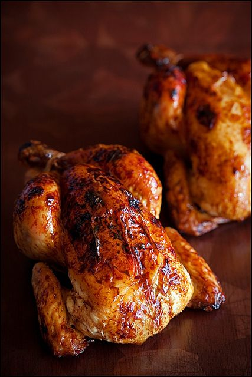

# Курица в глазури из вермута \| Chicken with crisp mahogany

#### Ингредиенты:

* 1 курица \(около 1,5 кг\)
* 1/2 ч. л. соли
* 1/2 ч. л. свежемолотого черного перца
* 2 ст. л. сухого вермута
* 2 ст. л. коричневого сахара
* 2 ст. л. бальзамического уксуса

#### Приготовление

Нагреть духовку до 190 С.

Посыпать курицу солью и перцем. Положить ее грудкой вверх, поднять крылья вверх к шее и загнуть их под спину, связать вместе ноги кулинарной нитью. Положить курицу грудкой вверх на решетку на средний противень. Жарить курицу 45 минут.

Приготовить глазурь: смешать в маленькой миске вермут, коричневый сахар и уксус, чтобы сахар растворился.

Через 45 минут намазать курицу глазурью. Увеличить температуру до 200°С; жарить еще 30 минут, дважды обмазав глазурью, пока термометр не покажет 74,5—77°С и сок, вытекающий из самой толстой части бедра, проколотой ножом, не будет прозрачным.

Выложить курицу на теплое блюдо и дать постоять 15 минут, не охлаждая.

В это время добавить 6О мл воды к мясному соку на противне и довести до кипения на среднем огне, помешивая, пока коричневые комочки не растворятся. Снять с огня, удалить жир.

Подавать курицу с мясным соком.

_по книге Le Cordon Bleu_
