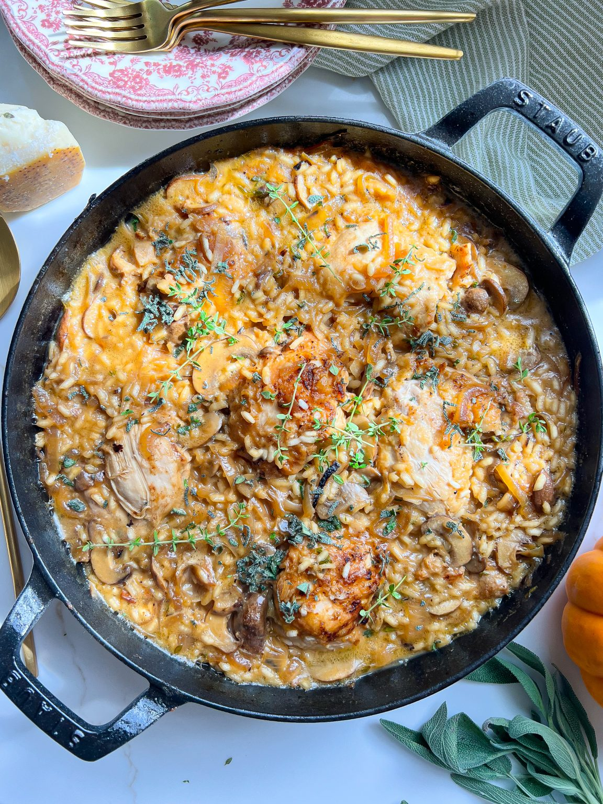

# Тушеная в сидре курица с рисом

#### Ингредиенты

4 - 6 порций

* куриные бедра (без кожи) 900 г
* цельнозерновая мука 1 ст л
* соль 1,5 г
* паприка 1,5 г
* оливковое масло 2 ст. л.
* грибы 450 г
* свежий шалфей и тимьян 2 ст. л
* сырой рис для ризотто 300 г
* бульон 350 мл
* яблочный сидр 240 мл
* легкие сливки (10–15%) 30 мл
* тертый пармезан 30 г
* шпинат 100 г

#### Приготовление

В большой сковороде на среднем огне разогреть 1 ст л масла. Добавить нарезанные грибы и рубленую зелень и обжарить 2–3 минуты. Отложить на тарелку.

В большой миске смешать муку, соль, черный перец и паприку. Обвалять в смеси куриные бедра, стряхнуть излишки муки. В сковороде разогреть еще 1 ст л масла, обжарить куриные бедра с обеих сторон по 2–3 минуты, выложить курицу на тарелку.

Обжарить рис, добавить горячий бульон, яблочный сидр и сливки. Довести до кипения.

Вернуть курицу обратно в сковороду, уменьшить огонь и варить на медленном огне под крышкой 15–20 минут, до готовности. Добавить тертый пармезан.

*Tiktok:brightmomentco*
