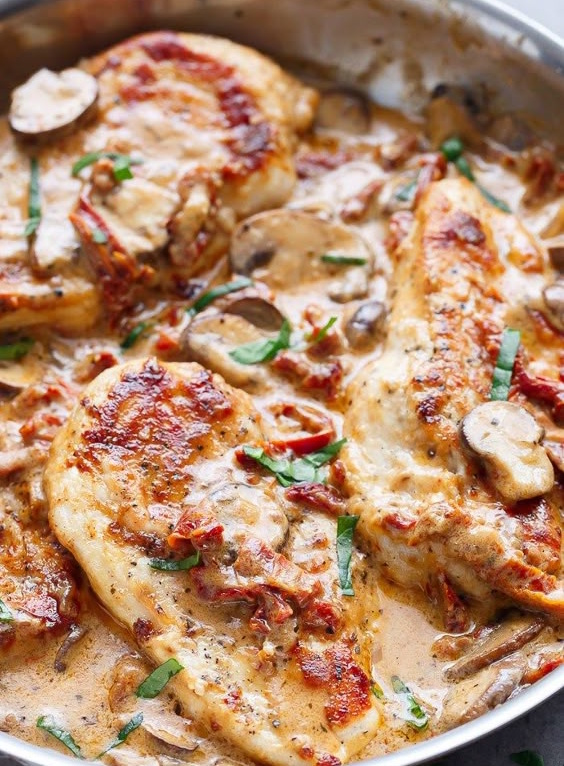

---
image: ../pics/creamy-chicken.jpg
---
# Куриное филе в сливках с вялеными томатами и пармезаном

#### Ингредиенты

на 6 порций

* 6 филе грудки
* мука 2 ст л
* пармезан 10 г
* соль, перец по вкусу

**для соуса:**

* чеснок 2 зубчика
* вяленые томаты 100 г
* грибы 250 г
* сливки 150 мл
* крахмал 1 ст л
* пармезан 10 г
* итальянские травы, свежий базилик по вкусу

#### Приготовление

В неглубокой миске смешать муку, сыр пармезан, соль и перец. Обвалять курицу в муке, лишнее стряхнуть.

Разогреть 1 столовую ложку масла в большой сковороде на среднем огне. Обжарить курицу до золотистого цвета \(5-6 минут с каждой стороны, в зависимости от толщины\). Выложить на теплую тарелку.

Добавить оставшуюся 1 столовую ложку масла в сковородку. Обжарить чеснок примерно минуту. Добавить томаты и грибы, обжаривать пока грибы не станут мягкими.

Уменьшить огонь, добавить молоко или сливки и довести до кипения, постоянно помешивая. Добавить соль и перец по вкусу, затем добавить смесь крахмала и молока. Кипятить до загустения смеси. Добавить пармезан и кипятить соус еще минуту, пока сыр не расплавится.

Выложить курицу обратно на сковороду.

Посыпать свеженарезанным базиликом и перцем \(по желанию\), подавать с пастой, рисом или овощами
