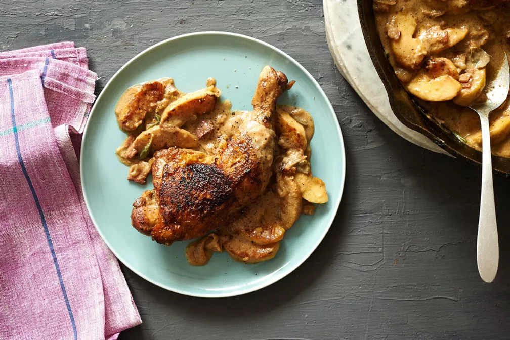

# Куриные ножки в сидре с беконом и яблоками \| Creamy Cider-Dijon Chicken Legs with Bacon and Apples

#### Ингредиенты

4 порции

* 4 целые куриные ножки
* Соль и перец по вкусу
* растительное масло для обжаривания
* 5 небольших яблок Гренни Смит, очищенных от кожуры и сердцевины и нарезанных средними дольками
* 5 луковиц шалот, очищенных и нарезанных тонкими кольцами
* 3 кусочка бекона, нарезанного на мелкие кусочки
* 360 мл сухого крепкого сидра
* 2 ст л дижонской горчицы
* 120 мл густых сливок
* 1 горсть свежих листьев шалфея

#### Приготовление

Обсушить курицу бумажным полотенцем. Щедро приправить обе стороны солью и перцем.  
В сковороде с толстым дном разогреть масло. Начав кожей вниз, обжарить курицу до темно-золотистого цвета. Снять на тарелку и отложить в сторону.

Добавить яблоки в горячий куриный жир и обжарить до карамелизации. Отложить в отдельную посуду.

Добавить в сковороду лук-шалот и бекон. Периодически помешивая, обжарить смесь, пока лук-шалот не станет прозрачным, около 5 минут.  
Влить сидр, соскрести все кусочки, прилипшие к сковороде. Вмешать горчицу и приправить солью и перцем. Добавить куриные ножки в смесь сидра и специй, перевернуть несколько раз, чтобы они покрылись жидкостью со всех сторон.  
Довести до кипения, накрыть крышкой и убавить огонь. Тушить до мягкости около 25 минут.

Вынуть курицу. Добавить в сковороду сливки, перемешать и снова довести до кипения.  
Варить от 3 до 5 минут, чтобы соус загустел. Добавить яблоки и шалфей, перемешать, выложить курицу сверху.

*food52.com*