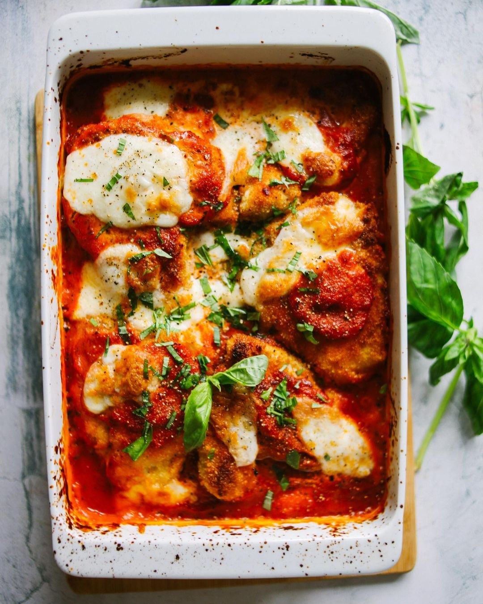

---
image: ../pics/crusty-chicken.jpg
---
# Хрустящее куриное филе в сыре

#### Ингредиенты

* Филе куриное - 850 г 
* Панировочные сухари - 150 г 
* Яйцо - 2 шт 
* Мука - 100 г 
* Томаты протертые - 500 г 
* Чеснок - 2-3 дольки 
* Сахар - 2 столовых ложки 
* Вино красное сухое - 100 мл
* Базилик свежий - 2-3 стебля 
* Пармезан - 50 г 
* Моцарелла рассольная - 2 шарика 
* Масло оливковое
* Соль и перец по вкусу

#### Приготовление

Приготовить соус. Лук, чеснок и сельдерей нарезать крупно, обжарить в большом сотейнике на оливковом масле до мягкости и румяного цвета. Добавить сахар и вино, выпарить. Добавить перетертые томаты, посолить и поперчить по вкусу и дать покипеть на среднем огне минут 10. Пюрировать при помощи блендера, добавив листья свежего базилика 

Куриное филе разрезать вдоль пополам на два тонких кусочка. Подготовить 3 миски. В одной смешать муку с щепоткой соли и перцем, во второй взбить яйца до однородности, в третьей смешать панировочные сухари с натертым пармезаном. В большой сковороде разогреть оливковое масло на среднем огне. Каждый кусочек филе обвалять в муке, затем обмакнуть в яйцо и затем переложить в миску с сухарями и сыром, филе должно быть полностью покрыто панировкой. Обжаривать филе до красивой румяной корочки, периодически подливая масло. 

Моцареллу порвать руками. 

Духовку разогреть до 200 градусов. 

В глубокую форму для запекания выложить немного соуса на дно, сверху выложить филе и залить соусом. Сверху разложить моцареллу, убрать в духовку на 15 минут до тех пор, пока сыр не расплавится и не подрумянится. 

[_https://www.instagram.com/p/COFRPWtH\_K-/_](https://www.instagram.com/p/COFRPWtH_K-/)

