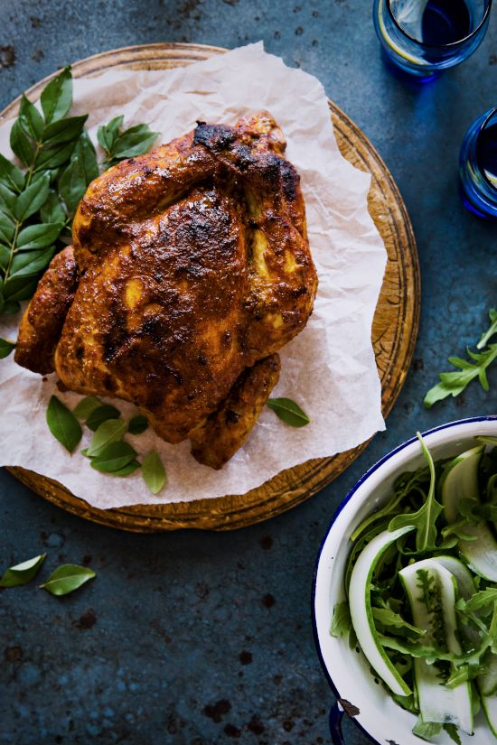

---
image: ../pics/e354d9cbc0165bf1634b0f2c668a6f50.jpg
---
# Цыпленок по индийски \| Indian Roast Chicken

#### Ингредиенты

* 125 мл йогурта
* 1 дюйм имбиря
* 4 зубчика чеснока
* 1 чайная ложка порошка тмина
* 1 чайная ложка порошка кориандра
* молотый красный перец 1/2 чайной ложки
* 1/2 чайной ложки порошка куркумы
* 1/2 чайной ложки гарам масала
* 2 столовые ложки томатной пасты
* цедра 1 лимона
* сок 1 лимона
* 60 мл подсолнечного масла
* цыпленок 1,3 кг
* 2 горсти листьев карри

**для салата:**

* 2 огурца
* 1 пучок руколы
* 2 столовые ложки оливкового масла

#### Приготовление

Разогреть духовку до 180 градусов по Цельсию.  
Взбить йогурт, натереть имбирь, измельчить чеснок.  
Смешать первые 12 ингредиентов в миске и тщательно обмазать курицу, нафаршировать листьями карри и обвязать шпагатом. Поместить на противень и запекать 30 минут.

Добавить на противень 250 мл воды, полить курицу полученным соком и запекать еще 90 минут, периодически поливая соком.

Приготовить салат. Потереть огурец вдоль на терке для получения длинных тонких ломтиков. Поставить в миску с ледяной водой и льдом на 10 минут, чтобы он стал хрустящим. Слить воду и перемешать с рукколой и оливковым маслом. Приправить солью и перцем и сразу подавать с курицей.

*sipsandspoonfuls.com*
