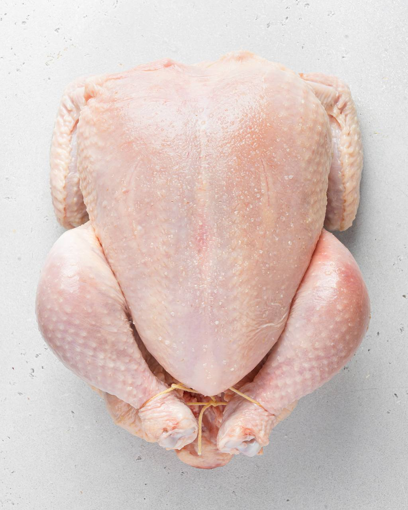

# Курица и птица

### Теория запекания курицы/цесарки 

Идеальный вес курицы \(потрошённой\) -1-1,2 кг. Это примерно 5-6 месячная курица.
Курицу без кожи запекать нельзя.

#### Приготовление

Выдержать в рассоле. Для рассола вам потребуется: 4 ст.л. мелкой морской соли или 8 ст.л. крупной морской соли и 2 литра холодной воды \(можно чуть больше\). Налить воду в высокую кастрюлю, добавить соль и размешать до полного ее растворения. Поместить в кастрюлю птицу, сверху накрыть тарелкой, чтобы она не всплывала и поставить в холодильник на 2-5 часов \(не более!\). Птицу вынуть из воды и обсушить бумажными полотенцами, а затем оставить в холодильнике на ночь.

Достать птицу из холодильника как минимум за 40 минут до запекания и обсушить бумажными полотенцами ещё раз. Так у вас будет идеальная хрустящая корочка и сочное мясо. Если под кожей видны пузыри воздуха или жир — сделать в этих местах проколы, это даст контроль и поможет жирам смазывать курицу во время выпекания.

Смазать оливковым маслом тонким слоемо, для того, чтобы пряности смогли закрепиться на поверхности. Сливочное масло работает хуже. Мелко порубить травы, сложить смесь в удобную емкость. Хорошо перемешать смесь и затем натереть ею птицу. Изнутри и снаружи. Промассажировать смесью как следует птицу. Это важно. Внутри имеет смысл создать ароматический каркас: крупные куски лимона, свежие травы.

 Крылышки подвернуть так, чтобы кончик касался позвоночника (то есть подложите его под курицу). Так они не развернутся, а концы не подгорят. Курицу очень желательно связать кухонной бечевкой, чтобы она держала форму во время приготовления: сделать петлю снизу в верхней части (где шея), дальше тянуть нити вдоль линий грудки, сделать перекрестие, а затем обмотать ножки и стянуть вместе. 

Выпекать курицу нужно на подиуме — это решетка или рубленные овощи, чтобы под ней циркулировал воздух и она не тонула в собственном соке. Выложить птицу в форму так, чтобы тушка была спиной вверх и соответственно филейной частью вниз. Поставить форму в предварительно разогретую до 230 С духовку \(статика\). Уменьшить температуру до 220 С. Запекать птицу в течение примерно 20-30 минут. Затем перевернуть и запекать ещё 20 минут при температуре 180 С. Можете передвинуть с одного бока на другой. 

Птица готова, когда температура мяса в бедре достигла 80 С или в самом глубоком месте грудки (у центрального хряща) - 70 С 

_fb: ellamartinoitaly_
