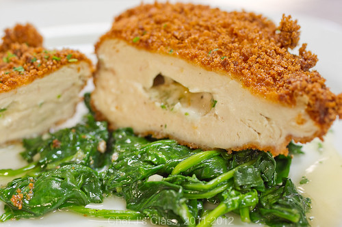

# Котлета по киевски

#### Ингредиенты

* Филе куриное
* Панировочные сухари
* сливочное масло

#### Приготовление

Подготовить масло: масло довести до комнатной температуры, добавить соль и белый перец (можно добавить травы и другие специи, печёный чеснок и т.д.), охладить.

Со стороны филе, противоположной стороне где была кожа, сделать продольный надрез на половину глубины. Сделать два горизонтальных надреза в стороны от центра. Внутрь этого кармашка выложить масло. Прикрыть масло расплющенным плоской стороной ножа тенделоином (легко отделяющаяся маленькая мышца на грудке), подтыкая края внутрь кармана.  
Котлеты можно заготовить заранее и держать в холодильнике до готовки, но они должны быть без панировки.

Панировку сделать перед самой жаркой во фритюре и перед панировкой выдержать котлеты до комнатной температуры. Обжарить во фритюре до золотистого цвета. Наконец, котлете нужен отдых, чтобы масло чуть остыло и успело впитаться в куриную мякоть изнутри.

*lyukum.livejournal.com*
