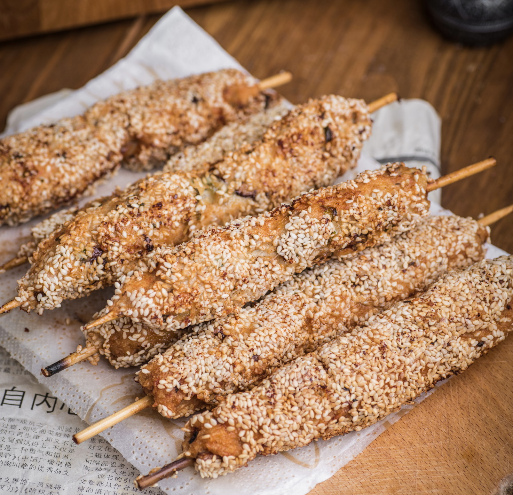

# Куриные мини кебабы

## Ингредиенты:

* 500г куриного филе
* 50 г. бекона или панчетты
* 1 яичный белок
* 15 лесных орехов
* 1 ст.л. тыквенных семечек.
* 1 ч.л. соли
* 1 ч.л. сахара
* 1 ч.л. крахмала
* 2 ч.л. кунжутного масла
* масло для жарки
* бамбуковые или деревянные шампура или шпажки
* сушеные грибы шиитаке - опционально

## Приготовление:

За полчаса замочить шампура в воде. Грибы шиитаке замочить в кипятке на полчаса.

Нарезать курицу и бекон кубиком, поместить в комбайн или блендер и превратить в однородную массу.

Отдельно в пиале смешать белок, соль и сахар, крахмал и кунжутное масло, перемешать все и вылить в блендер, пробить до однородности.

Шиитаке вынуть из воды, удалить ножки и нарезать кубиком шляпки. Орехи и семечки мелко порубить, зеленый лук мелко нарезать. Добавить лук, грибы и орехи с семечками к мясу и хорошо все смешать.

Мокрыми руками распределить мясо вокруг шампуров, прижимая и распределяя мясо по всей длине.

Кунжутные семечки высыпать в подходящую плоскую емкость. Прокатать каждый кебаб, чтобы кунжут покрыл всю поверхность.

Приготовить во фритюре или запечь.

[_https://telegra.ph/Kurinye-mini-kebaby-k-pyatnichnomu-pivu-i-ne-tolko-07-19_](https://telegra.ph/Kurinye-mini-kebaby-k-pyatnichnomu-pivu-i-ne-tolko-07-19)

