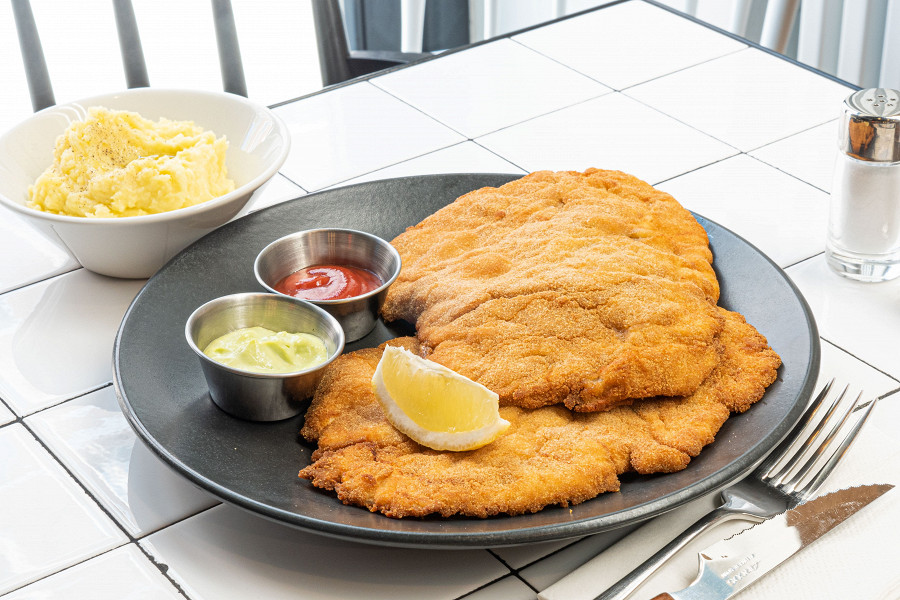

# Куриный шницель

Шницель — тонкий, слегка отбитый кусок мяса, который сначала крепко панируют, а потом обжаривают в большом количестве масла. Какое мясо — уже не важно. Классический венский шницель делают из телятины. Проживающие по соседству с Австрией чехи делают что-то похожее на шницель уже из свинины и называют это блюдо «ржизек». Есть свой шницель и в Израиле — делают его из куриной грудки и готовят практически на каждом углу.

#### Ингредиенты

4 порции

* Куриная грудка (плотное не перемороженное мясо) 2 штуки
* Куриное яйцо 4 штуки
* Соевый соус 50 мл
* Дижонская горчица 50 г
* Белые сухари 500 г
* Растительное масло 1 л

#### Приготовление

Избавить куриную грудку от косточки, жилок и малого филе. Разрезать ее пополам вдоль волокон, чтобы получилось две одинаковые половинки.  
Накрыть куриное филе пленкой, слегка отбить шницель кухонным молотком, сильно отбивать курицу не нужно, иначе вместо тонкой, нежной прослойки мяса вы получите фарш.  

Приготовить льезон, соединив яйца, соевый соус и горчицу. Энергично взбить венчиком.  
Окунуть шницель в сухари, чтобы они полностью облепили курицу.  
Аккуратно опустить филе в льезон, а потом снова в сухари.  
Положить шницель на доску, тщательно постучать по нему, чтобы прибить к нему хорошо сухари.  
Налить в сковородку 250 мл масла, как только оно нагреется, погрузить в горячее масло шницель. Пожарить его сначала с одной стороны, затем с другой — по три минуты с каждой стороны.

Подавать с картофельным пюре и долькой лимона.

*Рецепт Константина Борисова, шеф-повара ресторана Dizengof 99*
