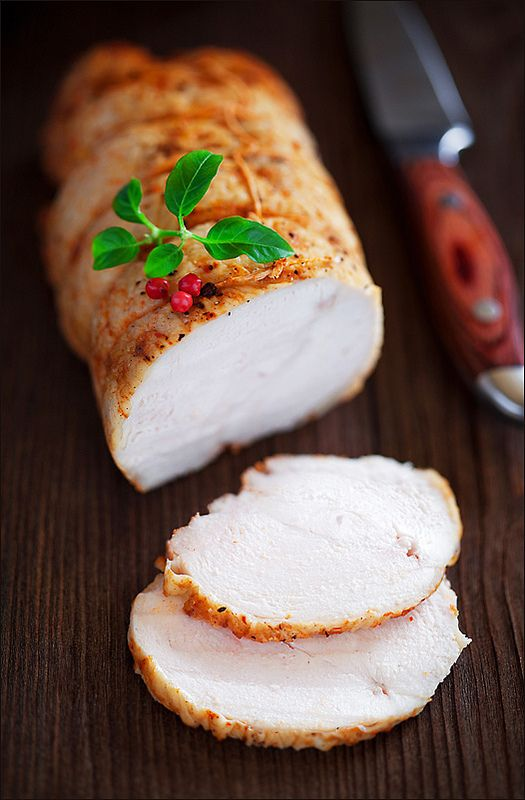

---
image: ../pics/pastorma.jpg
---
# Пасторма

#### Ингредиенты

* грудка курицы или индейки 1 кг
* острая горчица 1 ст л
* молотый сладкая паприка 2 ч л
* молотая острая паприка 1 ч л
* чеснок 4 зубчика
* мускатный орех 1/4 ч л
* растительное масло 2 ст л
* мёд 1 ч л
* свежемолотый черный перец

#### Приготовление

Соль растворить в холодной воде. Залить грудку соленой водой, убрать в холодильник на 3 часа минимум.

Чеснок измельчить, смешать с горчицей, паприкой, перцем, маслом и мёдом.

Грудку вынуть из соленой воды, обсушить бумажными полотенцами и туго обвязать кулинарной нитью. Чем туже свернуто и обвязано мясо, тем более однородным будет кусок при нарезке. Натереть грудку горчичным маринадом, оставить при комнатной температуре на 30 минут или убрать в холодильник на несколько часов.

За 30 минут до запекания достать грудку из холодильника. Духовку разогреть до 230 градусов.

Противень застелить бумагой для выпечки, выложить на него грудку. Запекать в середине предварительно разогретой духовки 20 минут, выключить духовку и оставить пастрому в ней на 2 часа. Готовую пастрому как можно плотнее обернуть фольгой и убрать в холодильник минимум на 2 часа.

_lg: laperla-foto_

