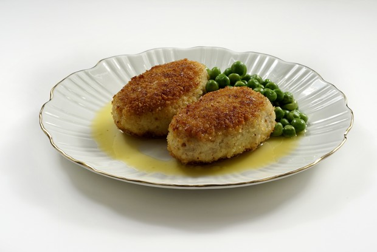

---
image: ../pics/pozarskie.jpg
---
# Пожарские котлеты

#### Ингредиенты

* куриный фарш 700 г
* белый хлеб 100 г
* молоко
* панировочные сухари 50 г
* сливочное масло 20 г + 50 г
* растительное масло для жарки
* соль по вкусу

#### Приготовление

Замочить хлеб в молоке, масло (20 г) довести до мягкости. Пропустить хлеб через мясорубку, смешать с фаршем, добавить сливочное масло, соль, хорошо вымешать.

Слепить из фарша котлеты, обвалять котлеты в сухарях, обжарить котлеты на растительном масле с двух сторон до красивой корочки.

Разогреть духовку до 200 градусов конвекция. Запечь котлеты 15 минут.

Растопить оставшееся сливочное масло, смазать кисточкой готовые котлеты.

*eda.ru*