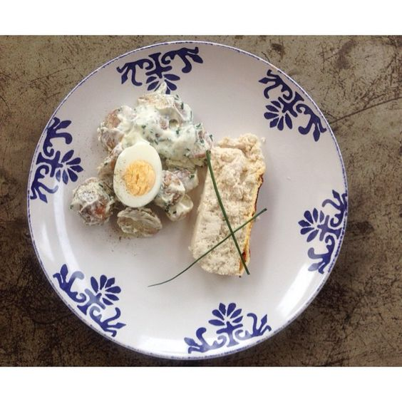

---
image: ../pics/souffle.jpg
---
# Суфле из курицы

#### Ингредиенты

* сливочное масло 2 ст л
* куриное филе 500 г
* 2 яйца
* мука 20 г
* молоко 60 г
* соль по вкусу

_опционально 50 г орехов_

#### Приготовление

Картофель натереть на терке.

Мясо нарезать, перемолоть в блендере. _Для мягкости предварительно отмочить в молоке 2 часа_

Яйца разделить на белки и желтки. Соединить мясо, муку и желтки, посолить, перемешать.

Белки взбить с щепоткой соли в крепкую пену. Выложить взбитые белки в фарш и крайне осторожно вмешать их в основную массу.

Разложить по формам и в запекать в духовке 20-30 минут при 160-180 градусов.

Готовое суфле посыпать молотыми грецкими или миндальными орехами

_ig: goodenoughcoffee_

