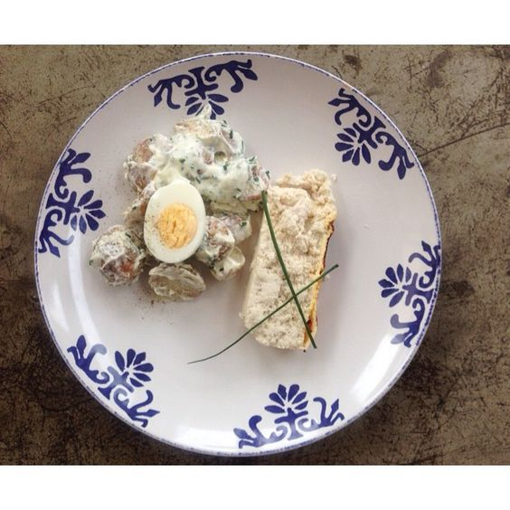

# Суфле из курицы

#### Ингредиенты

* куриное филе 500 г
* укроп
* сметана 15 %
* 1 яйцо
* соль, перец по вкусу

_опционально 50 г орехов_

#### Приготовление

Мясо нарезать, перемолоть в блендере. Укроп мелко нарезать.

Яйцо разделить на белок и желток. Соединить фарш, укроп, сметану и желток, посолить, перемешать.

Белок взбить с щепоткой соли в крепкую пену. Выложить взбитый белок в фарш и крайне осторожно вмешать в основную массу.

Выложить в форму и запечь в духовке 40 минут при 170 градусов.

Готовое суфле посыпать молотыми грецкими или миндальными орехами

_ig: goodenoughcoffee_

