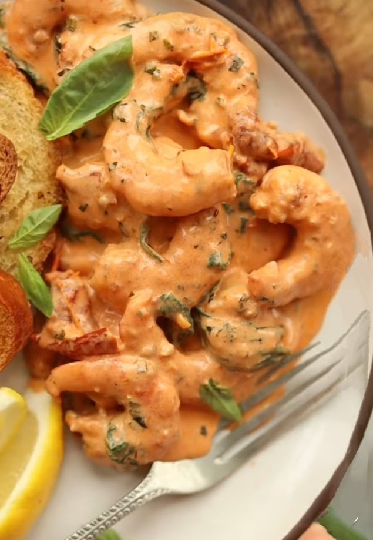

---
image: ../pics/creamy-tuscan-prawns.jpeg
---
# Кремовые креветки по-тоскански

#### Ингредиенты

* 500 г сырых, очищенных королевских креветок
* 2 ст. л. масла из вяленых томатов из банки
* 1/2 ч. л. соль
* 1/2 ч. л. черный перец
* 2 ст. л. несоленого масла
* 4 зубчика чеснока
* 1/4 ч. л. копченая паприка
* 1/4 ч. л. орегано
* 1 ст. л. томатной пасты
* 120 мл куриного бульона
* 240 мл густых сливок комнатной температуры
* 125 г вяленых томатов
* 40 г тертого пармезана
* 15 г свежего базилика
* 100 г листьев молодого шпината
* Гренки и дольки лимона для подачи

#### Приготовление

Тщательно обсушить креветки, смешать с 2 ст. л. масла, 1/2 ч. л. соли и перца.  
Разогреть большую сковороду на сильном огоне. Когда она нагреется, выложить половину креветок и оставить жариться на 1 минуту. Перевернуть их, жарить еще минуту. Постараться, чтобы они не сворачивались в форме «О», так как это обычно означает, что они пережарены. Снять и повторить со второй партией.

Уменьшить огонь до среднего и растопить масло. Добавить чеснок, копченую паприку и орегано и жарить около 30 секунд, затем добавить томатное пюре и жарить около минуты. Добавить бульон и сливки, затем добавить пармезан, вяленые помидоры и базилик. Тушить несколько минут, пока соус не станет достаточно густым, помешивая довольно часто. Добавить шпинат вместе с оставшимися соками креветок. Как только шпинат начнет увядать, добавить креветки. Немного выжать лимон в конце, это помогает разбавить насыщенный соус.

Подавать с гренками и дольками лимона

*Tiktok: Chris Collins*
