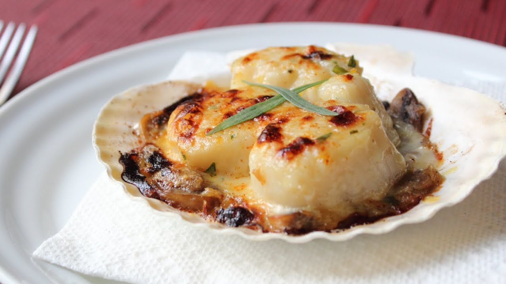

# Гратэн с гребешками

#### Ингредиенты:

* 6 ст. л. сливочного масла комнатной температуры
* 6 больших зубчиков чеснока
* 2 шалота
* 60 гр. прошутто
* 4 ст. л. порубленной петрушки
* 2 ст. л. лимонного сока
* черный перец по вкусу
* 1/2 ст. сухарей 
* 6 ст. л. белого сухого вина
* 900 гр. гребешков

#### Приготовление:

Духовку разогреть до 210C.

Приготовить 6 индивидуальных гратэновых форм и в каждую добавить по 1 ложке вина. Или использовать одну большу, соответственно налить все 6 ложек.

Разложить гребешки по формочкам. В чаше миксера смешать масло, чеснок, шалот, прошутто мелко порезанные, петрушку, перец и сок. Добавить сухари и перемешать лопаткой. Разложить массу на гребешки равномерным слоем. Запекать 10-12 минут. Если хочется корочку поджаристее, то подержать под грилем еще 2 минуты. 

При подаче сбрызнуть лимонным соком и подать хрустящий французский батон.

_https://home-chef.livejournal.com/75731.html_

