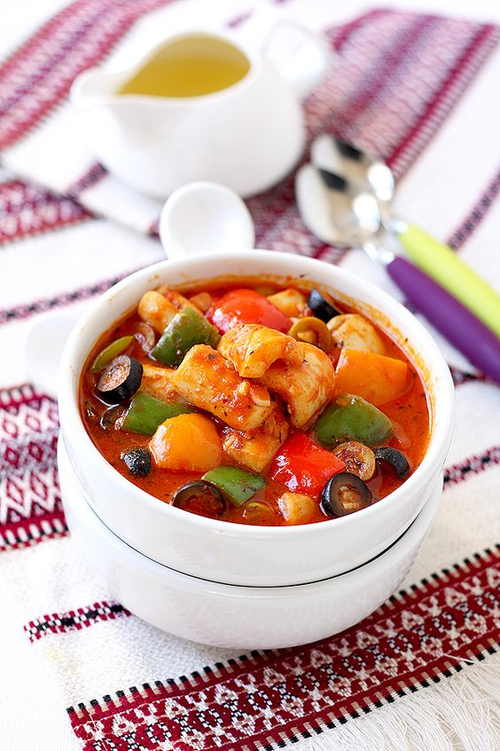

---
image: ../pics/e5115d4812876ccd26e5bb3e3e1e4220.jpg
---
# Кальмары в томатном соусе с сладким перцем и оливками

#### Ингредиенты
на 3-4 порции

* 600 гр очищенных кальмаров
* 550 гр помидоры
* красная луковица 1 средняя
* 5 зубчиков чеснока
* 3 небольших разноцветных сладких перца
* 4 ст.л нарезанные колечками оливки
* 4 ст.л нарезанные колечками маслины
* соус из запеченных перцев 2 ст.л
* 2 ч.л томатная паста
* 1 ч.л сахар
* соль по вкусу
* 250 мл овощной бульон
* 4 ст.л оливковое масло

**специи:**

* сушеный базилик 1 ч.л
* сушеный тимьян 1/2 ч.л
* сушеный орегано 1/2 ч.л
* 1/2 ч.л копченая острая паприка
* 2 ч.л сладкая паприка

#### Приготовление

Кальмары помыть, обсушить бумажным полотенцем и нарезать, я нарезала средними кубками,но можно и колечками. Перец очистить от семян и нарезать. Очистить чеснок, лук и мелко нарезать. На помидорах сделать крестообразные надрезы и бланшировать 1 минуту, после чего очистить от кожицы, взбить в блендере.

В сотейник добавить оливковое масло 2 ст.л. Обжарить лук,чеснок на небольшом огне до мягкости. Добавить томатную пасту, томаты, соус из запеченных перцев, бульон,сахар, специи, готовить около 5 минут, помешивая. На отдельной сковороде на 2 ст.л растительного масла поджарить перец около 1-2 минут, помешивая, а потом добавить в соус. А так же добавить к соусу кальмары и оливки с маслинами. Готовить всё вместе ровно 2 минуты.

Подавать блюдо с отварной пастой или отварным рисом.

*elena-fialka.livejournal.com*
