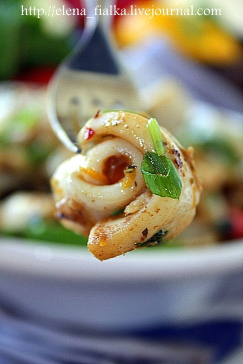

# Кальмары по- испански \| Orange-glazed calamari

###### Ингредиенты:

* Маленькие кальмары 750 гр
* 3 дольки чеснок
* 1 ч.л молотой паприки
* 2 ч.л цедра апельсина
* 1 ст.л апельсинового сока
* 1 ст.л красный винный уксус
* 65 гр коричневый сахар
* 4 ст.л оливковое масло
* 1 ст.л порезанной зелени кинзы

#### Приготовление:

Очищенные тушки кальмаров разрезать пополам. Помыть и порезать ленточками 2 на 5 см. Смешать в миске чеснок, паприку, апельсиновую цедру, апельсиновый сок, винный уксус, коричневый сахар, оливковое масло. Положить в соус кальмаров и оставить на 3 часа или на ночь.

Разогреть гриль или сковороду. Убрать кальмаров с соуса, соус не выливать. Пожарить кальмаров 3-4 минуты. Влить соус в другую сковороду, добавить зелень кинзы и потушить 2 минуты, после чего добавить кальмары, перемешать.Подавать немедленно

_Источник: журнал Womens Weekly Испанская кухня._

