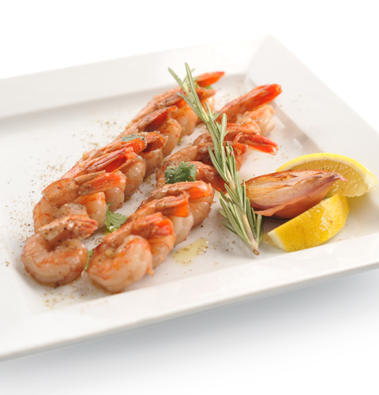

# Креветки с имбирем и хересом

###### Ингредиенты:

* Креветки 800 г 
* Масло сливочное 120 г 
* Имбирь корень 1 шт 
* Херес 8 ст.л. 
* Розмарин 10 г 
* Лимон 1 шт 
* Кинза свежая, соль, перец по вкусу

#### Приготовление:

Креветки очистить, оставив только хвостики, промыть в холодной проточной воде и обсушить. 

В сковороде среднего размера с тяжелым дном растопить на умеренном огне сливочное масло. Затем бросить туда тертый имбирьи пассеровать 30 секунд.Добавить креветки и обжарить 2 минуты. Влить херес и продолжить готовить еще 2 минуты. Добавить крупно нарезанную кинзу, приправить солью с перцем и перемешать. 

Подавать, украсив розмарином и лимоном.

[_http://av.ru/index.aspx?sPage=3782_](http://av.ru/index.aspx?sPage=3782)

