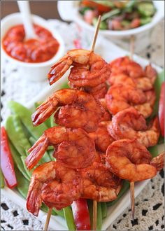

# Креветки тандури на шпажках

#### Ингредиенты

* Очищенные креветки 700 гр
* 2 ст.л лимонный сок
* 3 ст.л оливкове масло
* 1 ч.л рисового уксуса
* 2 ч.л жидкий мёд
* 3 ст.л без горки специи тандури масала
* Соль по вкусу
* Деревянные шпажки

#### Приготовление

Очищенные креветки сполоснуть и обсушить бумажным полотенцем,положить в миску. Посыпать специей тандури, добавить оливковое масло, мёд, уксус и лимонный сок,посолить по вкусу, перемешать. Оставить мариноваться на 30 минут. Замочить шпажки в теплой воде на 30 минут.

Надеть на шпажки креветки. Разогреть духовку до 200 гр. Выстелить противень фольгой, смазать оливковым маслом, положить на противень шпажки с креветками и запекать до готовности.

*elena-fialka.livejournal.com*