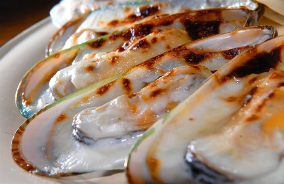

---
image: ../pics/midii-s-parmezanom-i-belim-vinom-16629.jpg
---
# Мидии с пармезаном и белым вином

#### Ингредиенты

* Молотый черный перец по вкусу
* Соль по вкусу
* Белое сухое вино 200 мл
* Чеснок 4 зубчика
* Петрушка 20 г
* Сыр пармезан 100 г
* Сливочное масло 20 г
* Оливковое масло 50 мл
* Мидии в ракушках (крупные, новозеландские мидии) 1 кг

#### Приготовление

Мидии залить водой пополам с белым вином и варить три минуты, после того как смесь воды и вина закипит.  
В миске смешать растопленное сливочное масло, оливковое масло, давленый чеснок, мелко нарубленную петрушку и тертый пармезан, самую малость соли и перец — по вкусу.  
Отломать одну створку у каждой мидии, оставив ту половину, где мясо. Смазать мидии смесью масла, чеснока, петрушки и пармезана и отправить жариться на раскаленный гриль.  
Как только сыр начнет плавиться, а масло пытаться кипеть — снять мидии с огня и выложить на блюдо. Хорошо успеть подать их к столу до тех пор, пока расплавленный сыр вновь не затвердеет.  
К мидиям нужно подавать бодрое и решительное белое вино типа гевюрцтраминера или рислинга.

*eda.ru*
