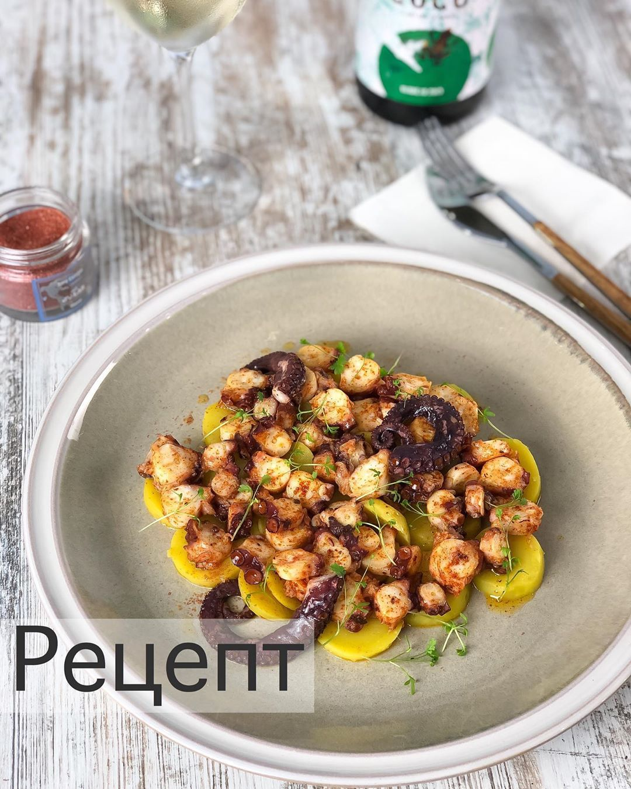

# Осьминог а-ля по-галисийски \| pulpo a la gallega

#### Ингредиенты:

* осьминог 
* лук 
* морковь 
* тимьян 
* лавровый лист 
* соль крупная 
* оливковое масло 
* паприка 
* острый красный перец 
* картофель

#### Приготовление:

В большой кастрюле довести до кипения воду с морковкой, луком, травами и солью. Опуститьв  в воду осьминога, вынуть, воду снова довести до кипения. И повторить ещё 2 раза. Так, по заверению испанцев, осьминог точно будет мягким. Мороженые осьминоги не требуют отбивания. 

Опустить осьминога в воду и варить от 30 минут до 1,5 часов до мягкости, вынуть. В воде от варки осьминога отварить картофель до готовности. Картофель нарезать дольками, осьминога шайбами. Полить оливковым маслом, посыпать перцем. Подавать горячим.

[_https://www.instagram.com/foodedlife/_](https://www.instagram.com/foodedlife/)

