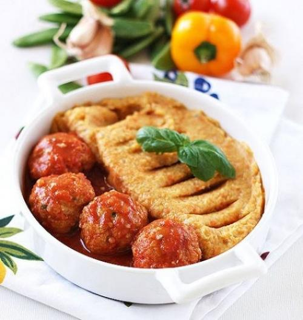

# Тефтели из креветок

###### Ингредиенты:

* 50 гр мелкие очищенные креветки
* 1 яичный белок
* 3 ст. л хлебные крошки
* 4 ст. л нарезанный базилик
* 1/3 ч. л копченая острая паприка \(или обычная\)
* молотый черный перец и соль по вкусу
* 200 гр томатов в собственном соку или 2 средних спелых помидора
* 1. 5 чашки овощного бульона
* 1 сельдерей
* 1 большая долька чеснока
* по щепотке сушеные травы: розмарин, тимьян, орегано

#### Приготовление:

В небольшой сотейник добавить томаты, бульон, давленый чеснок, дать закипеть, посолить соус, приправить травами и готовить около 2 минут помешивая. Можно оставить соус в таком виде, а можно взбить блендером. 

Креветки пропустить через мясорубку. Добавить к креветкам нарезанный базилик, посолить, приправить паприкой. Взбить белок в пену и добавить к фаршу, добавить хлебные крошки, перемешать. 

Из фарша сделать небольшие тефтели размером с грецкий орех. Аккуратно положить тефтели в томатный соус, добавить нарезанный сельдерей и готовить примерно 10 минут. Убрать из соуса сельдерей.

_elena-fialka.livejournal.com_

