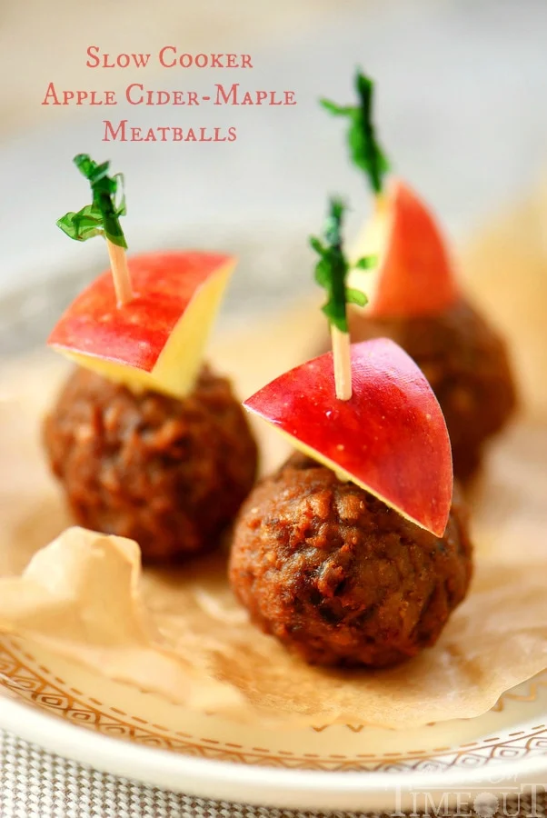

---
image: ../pics/slow-cooker-apple-cider-maple-meatballs.webp
---
# Фрикадельки с яблочным сидром \| Slow Cooker Apple Cider Maple Meatballs

#### Ингредиенты:

* мясной фарш 800 грамм
* панировочные сухари 2 ст.л.
* яйца 1 шт.
* соль по вкусу
* 2 стакана яблочного сидра
* 1/2 стакана кленового сиропа
* 3 ст л яблочного уксуса
* 2 яблока

#### Приготовление:

Смешать мясной фарше с сухарями и яйцом, солью по вкусу. Хорошо вымешать. Из фарша сформировать маленькие фрикадельки диаметром 3-3,5 см.

Сбрызнуть мультиварку кулинарным спреем. Выложить фрикадельки в мультиварку.

Яблоки очистить и мелко нарезать. Смешать яблочный сидр, кленовый сироп и яблочный уксус и залить фрикадельки. Сверху положить яблоки.

Накрыть мультиварку крышкой и варите на низкой мощности.

Подавать теплыми украсив нарезанными яблоками.

_momontimeout.com_

