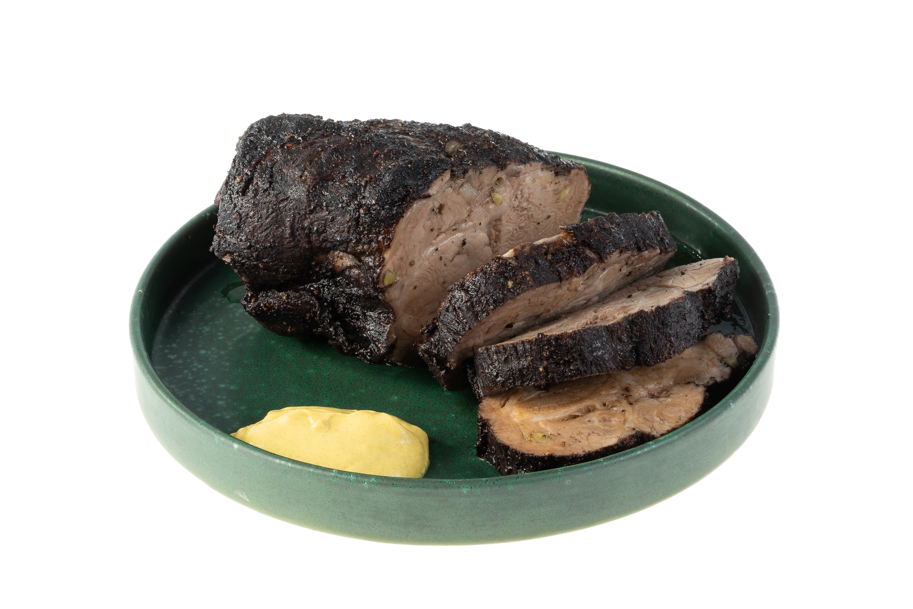

# Буженина

#### Ингредиенты

* Свиная шея 2½ кг
* Красное вино 1½ л
* Чеснок 1 головка
* Соль 3½ столовые ложки
* Черный перец горошком 10 штук
* Лавровый лист 1 штука
* Гвоздика 3 штуки
* Молотый черный перец по вкусу

#### Приготовление

Чеснок очистить, отложив 4 зубчика для шпигования мяса, и нарезать на половинки. В ступке раздавить гвоздику и горошины перца, бросить их в большую кастрюлю, влить вино, добавить соль и чеснок. Перемешать до полного растворения соли. Положить мясо в винный маринад, оно должно быть полностью покрыто маринадом. Накрыть крышкой и поставить в холодильник на 2 дня.

Достать мясо из маринада, обсушить бумажными полотенцами и оставить на час, чтобы мясо дошло до комнатной температуры. Маринад не выливать. 4 зубчика чеснока нарезать длинными брусками и нашпиговать ими мясо, проделав в нем дырки острым тонким ножом. Натереть мясо молотым черным перцем.

Переложить мясо в глубокий противень, влить немного маринада и отправить в духовку, разогретую до 210 градусов, на 15 минут. Затем понизить температуру до 160 градусов и продолжать запекать еще 2 часа. Периодически поливать мясо горячим маринадом с противня, если маринад выпарится, подлить в противень еще. Если мясо начнет подгорать, накрыть его фольгой. Чтобы проверить готовность буженины, проткнуть ее длинной вилкой или ножом, из мяса должен идти прозрачный сок.

Готовую буженину достать из духовки, завернуть в фольгу и оставить на 20 минут.

*eda.ru*
