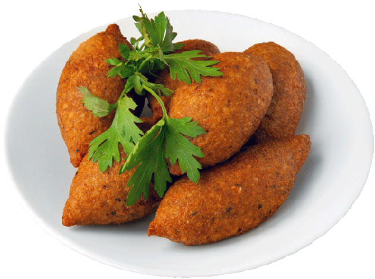

# Ишли кюфта \| Içli köfte

#### Ингредиенты:

* 300 г говядины \(филе или толстый край\)
* горсть грецких орехов
* 1 ст. булгура
* 1-2 луковицы
* 1 яйцо
* 2 консервированных томата
* горсть кедровых орехов
* 1 ст. л. семян пажитника
* 0.5 ч. л. мяты
* 0.5 ч. л. сухого острого перчика
* 0.5 ч. л. зиры
* 1-3 ст. л. муки
* 1 л. масла для жарки
* соль
* чёрный перец.

#### Приготовление:

Мясо зачистить от плёнок, нарезать тонкими ломтиками поперёк волокон, мелко порубить до состояния однородного фарша.

Пажитник подсушить, смолоть, запарить вместе с подсоленным булгуром 2 ст. кипятка, дать постоять под крышкой.

В масле обжарить мелко рубленный лук на малом огне до мягкости, всыпать и обжарить смолотые в ступке пряности, добавить мясной фарш, готовить на сильном огне до изменения цвета мяса на более светлый. Всыпать мяту, добавить и обжарить помидоры. К остывшей мясной начинке добавить смолотые орехи, мелко рубленную петрушку, посолить, перемешать.

В запаренный булгур всыпать муку, вбить яйцо, влить воду, вымесить и отбить массу до однородности \(если булгур крупноват, смолоть его блендером\). Лепить шарики из булгура, большим пальцем делая выемку, выложить внутрь фарш, защипать.

Жарить в масле при температуре 200°С до ровного румяного цвета. 

Подавать сразу.

[_http://www.fasol.tv/recepty/_](http://www.fasol.tv/recepty/detail.php?ID=3960)\_\_

