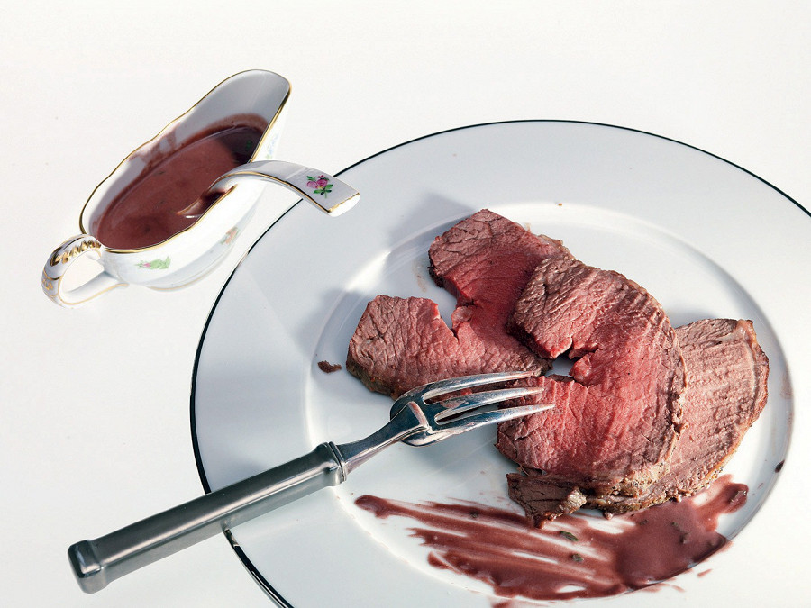

---
image: ../pics/roast_p_O.jpg
---
# Ростбиф

Это рецепт классического ­рост­бифа. Полученный результат можно есть как в горячем, так и в холодном виде. Ростбиф принято нарезать тонкими ломтиками (3–5 мм) и подавать с густыми мясными соусами.

#### Ингредиенты

* Говядина 1,5 кг
* Репчатый лук 1 головка
* Морковь 1 штука
* Сельдерей 1 стебель
* Букет гарни 1 пучок
* Соль по вкусу
* Растительное масло 50 мл
* Молотый черный перец по вкусу

#### Приготовление

Говядину очистить от пленок и жира, связать кулинарной ниткой, чтобы сохранить плотность и сочность, посолить, ­по­перчить и обжарить на растительном масле со всех сторон до корочки коричнево­го цвета. Затем ­вынуть мясо из сковороды, завернуть в фольгу и дать ему ­несколько минут отдохнуть в сторонке.

На сковороде тем временем обжарить морковь, лук и сельдерей на растительном масле, добавив для запаха небольшой кусок говяжьего жира.

Говядину вместе с овощами и букетом гарни положить на противень и запекать шестьдесят-семьдесят минут при температуре 200 градусов.

Достать мясо из духовки, опять завернуть его в фольгу и дать отдохнуть 10-15 минут.

[_https://eda.ru/recepty/osnovnye-blyuda/zapechennij-govjazhij-kraj-17670_](https://eda.ru/recepty/osnovnye-blyuda/zapechennij-govjazhij-kraj-17670)
