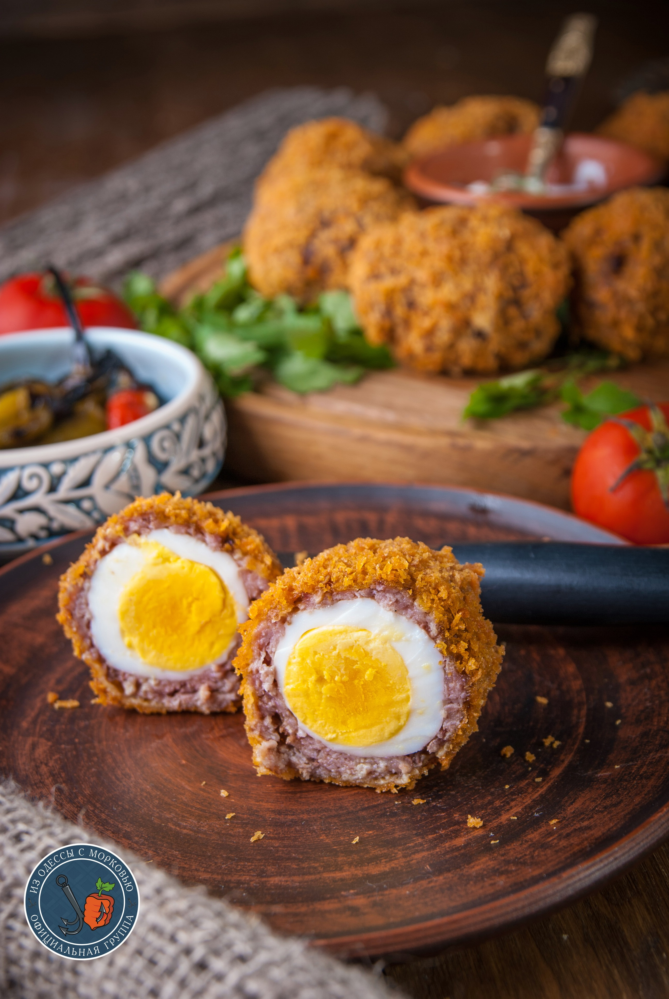

---
image: ../pics/scotch-egg.jpg
---
# Яйцо по-шотландски

#### Ингредиенты

* 8 куриных яиц, сваренных вкрутую
* мука со щепоткой соли и перца
* 500г фарш
* 1 яйцо, разболтанное с 1 ст.л. воды
* панировочные сухари
* масло для жарки
* _зелень петрушки, тимьян, горчица_

#### Приготовление

Сварить яйца.  
В фарш добавить соль, перец. Также можно добавить рубленую зелень петрушки, тимьян, горчицу.  
Приготовить емкость с маслом для фритюра.  
Часть фарша расплющить на ладони, поместив в центр яйцо и обернуть его фаршем, чтобы не было разрывов.  
Обвалять в муке. Смазать яйцом с водой с помощью кисти. Обвалять в сухарях.  
Готовить в разогретом до 200С масле 5-7 минут, обсушить на бумажных полотенцах.

_tg: OdessaCarrot_
