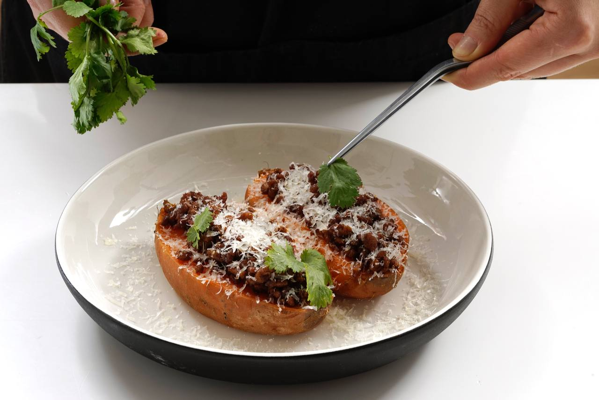

# Фаршированный батат

#### Ингредиенты

* Батат 2 штуки
* Говяжий фарш 300 г
* Паприка 1 чайная ложка
* Корица ¼ чайные ложки
* Кардамон ¼ чайные ложки
* Молотый перец чили ¼ чайные ложки
* Растительное масло 40 мл
* Сыр пармезан 30 г
* Кинза 15 г
* Соль по вкусу
* Молотый черный перец по вкусу
* Греческий йогурт по вкусу

#### Приготовление

Каждый батат обернуть фольгой. Отправить в духовку на час при 180 градусах. При готовке батата важно обращать внимание на его размер. Иногда он может запекаться 40 минут, а иногда — 1,5 часа. Готовность батата определяется с помощью шпажки.

Разогреть растительное масло, обжарить фарш на сильном огне до румяности. Добавить к фаршу корицу, кардамон, паприку, чили. Посолить, поперчить. Продолжить жарить фарш на среднем огне 10–15 минут.

Готовый батат извлечь из фольги, разрезать пополам, посолить. На каждую половину батата выложить горячий фарш. Посыпать тертым пармезаном.Украсить кинзой.

Подавать с греческим йогуртом.

*eda.ru*
