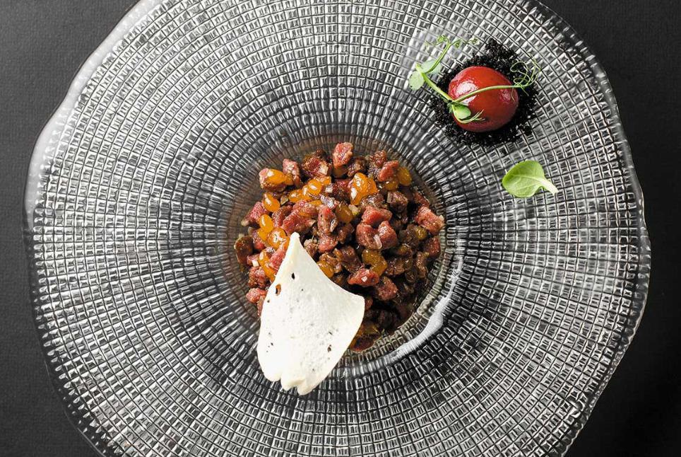

# Тартар из оленины с вареньем из морошки

#### Ингредиенты:

* филе оленины 120 г
* варенье из морошки 25 г
* масло с розмарином 15 г
* лук шалот 10 г
* хлеб 50 г
* можжевеловые ягоды 1 г

**для варенья из морошки:**

* сахар 100 г
* морошка 150 г

**для масла:**

* масло оливковое 50 г
* розмарин свежий 2 г

#### Приготовление:

**варенье:**  свежую ягоду засыпать сахаром, томить на медленном огне до образования густой массы

**масло:**  розмарин и масло пробить в блендере и процедить через сито

**тартар:** Нарезать оленину кубиком, мелко порубить шалот, заправить маслом с розмарином и добавить варенье. Мелко порубить ягоду можжевельника и добавить в тартар, посолить, поперчить и подавать с подсушенным хлебом

_Шеф - Валерий Горинов, Ресторан - Дом,_ [_https://t.me/culinary\_industry_](https://t.me/culinary_industry)

