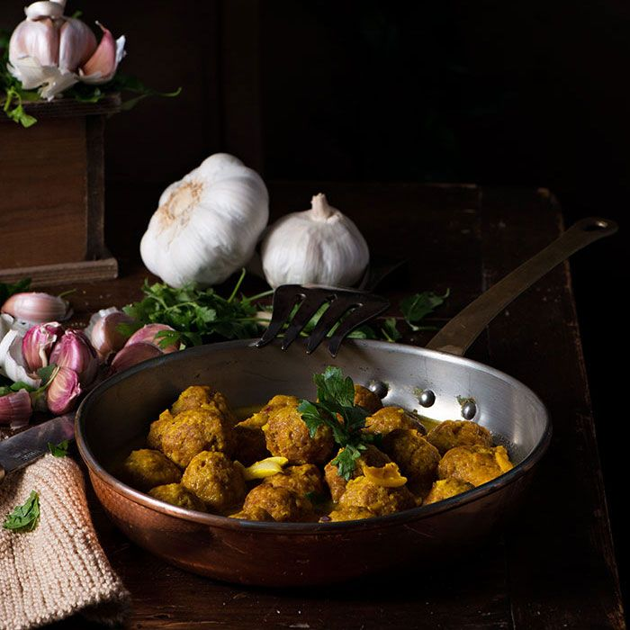

---
image: ../../pics/albondigas-en-salsa.jpg
---
# Фрикадельки в соусе с миндалем

#### Ингредиенты:
на 2 порции

* мясные фрикадельки

**для соуса:**

* миндаль 100 г
* сливочное масло
* кусок черствого хлеба
* чеснок 2 зубчика
* куриный бульон 750 мл
* шафран

#### Приготовление:

Заварить шафран в горячем бульоне. Растопить сливочное масло в кастрюле, подрумянить миндаль, хлеб и чеснок. Когда они будут готовы, вынуть их и растереть в ступке с небольшим количеством воды или бульона. 

Фрикадельки обжарить на сковороде с небольшим количеством масла.  
Выложить фрикадельки в кастрюлю и добавить заготовку соуса и остаток бульона, добавить остаток бульона и шафран, приправить солью и перцем и варить до загущения на слабом огне.

_cocinandoconmicarmela.com_

