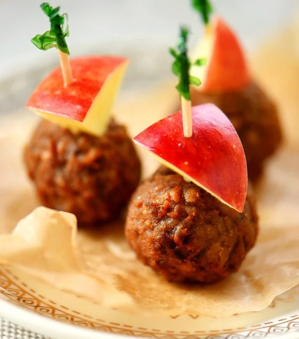

---
image: (../../pics/apple-cider-maple-meatballs.jpg
---
# Фрикадельки с яблочным сидром

#### Ингредиенты:
на 6 порций

* мясные фрикадельки

**для соуса:**

* яблочный сидр 400 мл
* кленовый сироп или мед 50 г
* яблочный уксус 60 мл
* 2 яблока
* 1 ст л крахмала

#### Приготовление:

Яблоки очистить и мелко нарезать. Смешать яблочный сидр, кленовый сироп и яблочный уксус.  
Фрикадельки запечь 10 минут при 200 С.  
Яблоки потушить в кастрюле с небольшим количеством соуса, залить остальным соусом прогреть, добавить крахмал и растворить. Выложить фрикадельки в кастрюлю, варить до загущения соуса и готовности на слабом огне.

_momontimeout.com_

