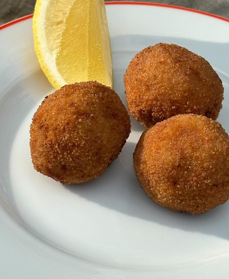

---
image: ../../pics/chorizo-olives.jpg
---
# Фрикадельки из чоризо с оливками и сыром

#### Ингредиенты
на 20 фрикаделек

* фарш чоризо 500 г
* зеленые оливки без косточки 20 шт
* сыр комте 100 г
* мука 20 г
* панировочные сухари 20 г
* 1 яйцо
* масло для жарки

**для лимонного майонеза:**

* майонез 2 ст л
* цедра и сок лимона
* соль

#### Приготовление

Нафаршировать оливки небольшими кусочками сыра. Взять кусочек фарша, расплющить, выложить внутрь оливку, залепить в шарик. Муку, яйцо и панировки выложить в 3 разных миски, обвалять поочередно шарики в муке, затем яйце, затем панировке. Обжарить во фритюре до золотистого цвета. Подавать с лимонным майонезом, перед подачей сбрызнуть лимонным соком. 

*ig: klarasmat*
