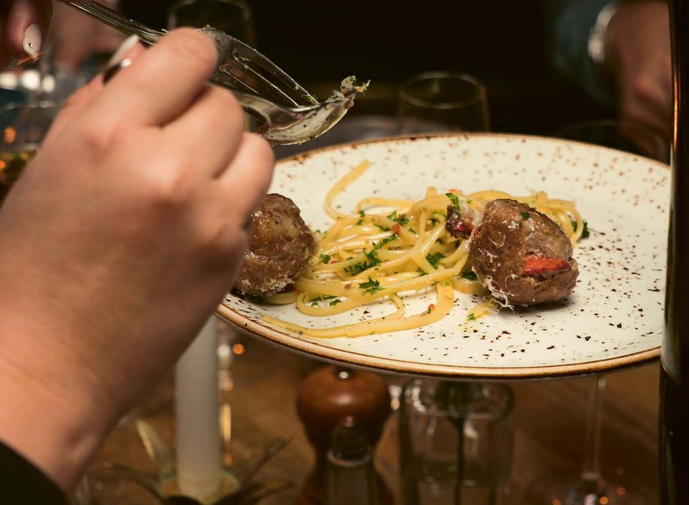

# Хипстерские фрикадельки с лингвини

#### Ингредиенты
на 38 штук

* фарш телятина 500 г
* морская соль 1 ст. л.
* сливки 30% 100 г
* мясо раков 200 г
* запеченное филе кролика 200 г
* фисташки очищенные 50 г
* свежий базилик 1 ст. л.
* хлопья красного перца 1 ч. л.
* сливочное масло для обжаривания

**для подачи:**

* паста лингвини 450 г

#### Приготовление

Вымешать телячий фарш с солью до уплотнения, затем влить сливки и перемешать пару раз. Добавить мелко нарезанное мясо кролика, мясо раков, мелко нарезанные фисташки, базилик и чили. Продолжать вымешивать, пока масса не станет однородной и плотной. Важно, чтобы все ингредиенты были равномерно распределены, а кусочки кролика и лобстера сохраняли свою форму. Сформировать из фарша около 34 ровных шариков (примерно по 30 г каждый, размером с шарик для настольного тенниса).

В большой сковороде на среднем огне растопить столько сливочного масла, чтобы оно доходило примерно до трети высоты фрикаделек. Выложить шарики (так, чтобы им не было тесно) и обжаривать порциями около 10 минут до румяной корочки и полной готовности внутри. Сок и масло на сковороде сохранить.

Тем временем отварить лингвини до состояния al dente. Хорошо слить воду и сразу переложить пасту в сковороду, где жарились фрикадельки, перемешав ее с масляным соком. Добавить фрикадельки, подавать украсив базиликом.

*Meatballs For The People by Mathias Pilblad*

