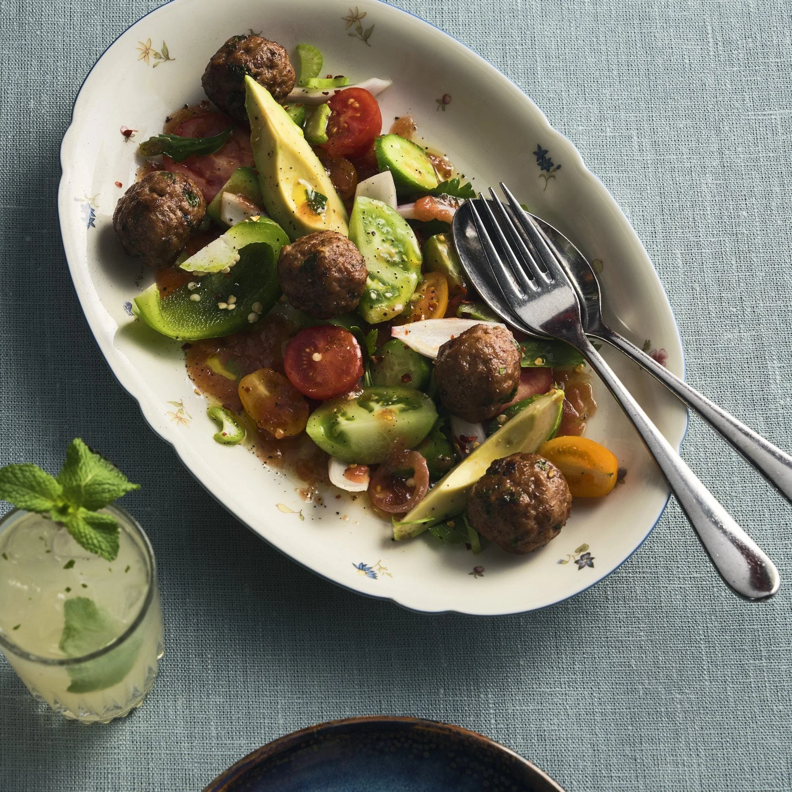

---
image: ../../pics/north-african-lamb.jpg
---
# Фрикадельки из баранины в североафриканском стиле

#### Ингредиенты
на 36 фрикаделек

* фарш баранины 1 кг
* 1 яйцо 
* куриный бульон 100 мл
* рас-эль-ханут 1 ст л
* петрушка

#### Приготовление

Хорошо перемешать фарш из баранины, яйцо и 2 чайные ложки соли в большой миске. Добавить куриный бульон, рас-эль-ханут и петрушку и хорошо вымесить до гладкости. Сформировать примерно 36 фрикаделек по 30 г.

Обжарить партиями в большой сковороде на сливочном масле, часто переворачивая 7–10 минут.

Подавать с кус-кусом и овощным салатом

*Meatballs For The People by Mathias Pilblad*
