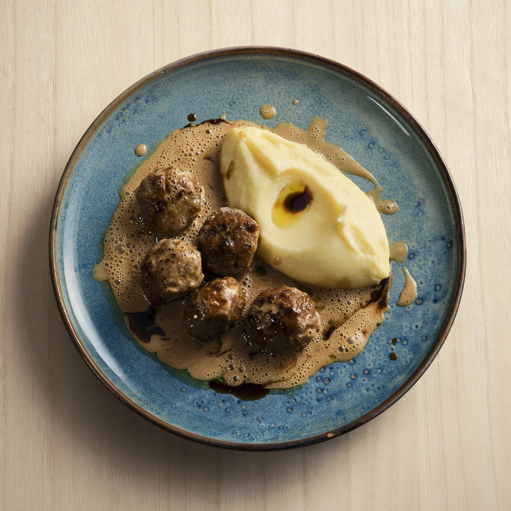

# Фрикадельки в винном соусе

#### Ингредиенты
на 2 порции

* мясные фрикадельки

**для соуса:**

* сливочное масло 10 г
* коричневый сахар 0,5 ч л
* красное вино 150 мл
* говяжий бульон 200 мл
* соль, черный перец
* кукурузный крахмал 1 ч л развести в 1 ч л воды

#### Приготовление

Растопить сливочное масло в сотейнике на медленном огне. Добавить сахар, вино и бульон и довести до кипения, помешивая. Уменьшить огонь и варите без крышки около 30 минут, пока соус не выпарится наполовину. Приправить солью и перцем по вкусу. Добавить пасту из кукурузного крахмала, медленно довести до кипения, помешивая, пока соус слегка не загустеет.

Подавать фрикадельки с теплым соусом и картофельным пюре

*Meatballs For The People by Mathias Pilblad*

