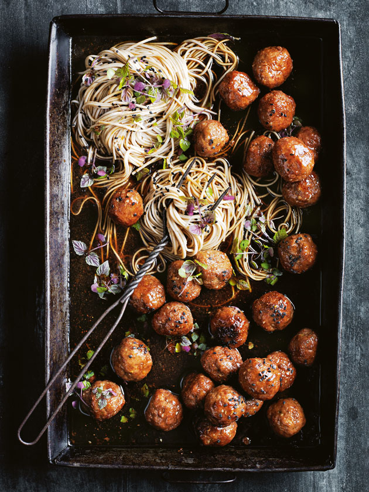

---
image: ../../pics/sesame-ginger-pork-meatballs.jpg
---
# Свиные фрикадельки с кунжутом и имбирем

#### Ингредиенты:
на 4-6 порций

* свиные фрикадельки
* лапша соба 270 г
* черный кунжут, Shichimi Nanami Togarashi (7 специй) для украшения

**для соуса:**

* порошок даси 1 ст л
* соевый соус 125 мл
* мирин 180 мл
* кунжутное масло 2 ч л
* рисовый уксус 2 ст л
* мед 90 г

#### Приготовление:

Чтобы приготовить липкий соевый соус, перемешать даси, соевый соус, мирин, кунжутное масло, уксус и мед в небольшой миске. 
Запекать фрикадельки 5 минут, затем вынуть противень из духовки, добавить соус  и осторожно перемешать, чтобы покрыть фрикадельки. Готовить еще 15 минут. Подавать фрикадельки с лапшой, посыпав кунжутом и специями.

_donnahay.com.au_

