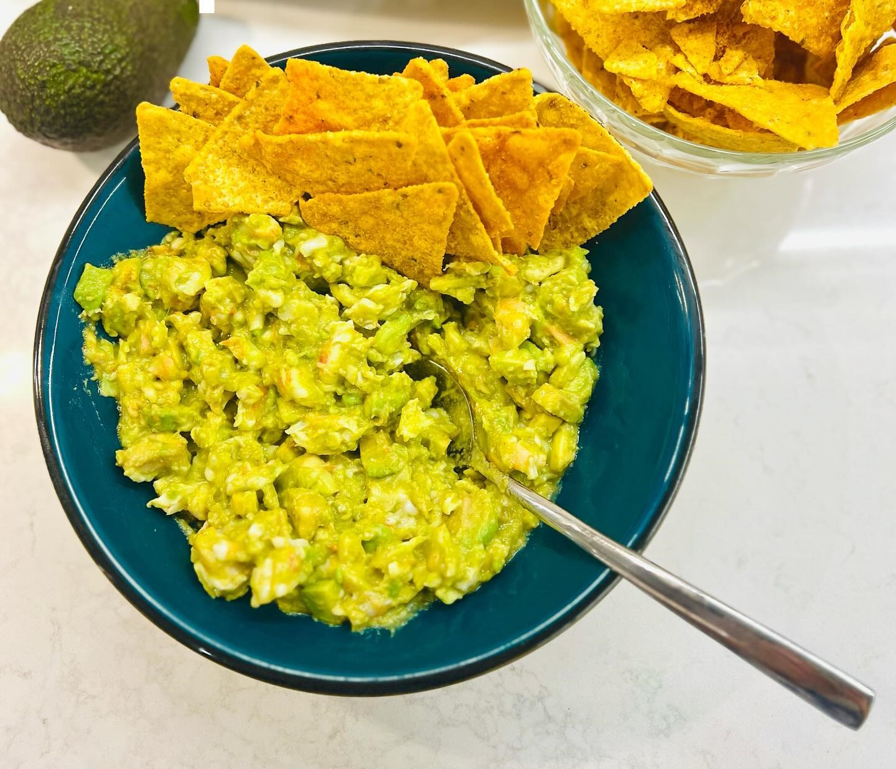

---
image: ../pics/avocado-shrimp.jpg
---
# Креветки с авокадо

#### Ингредиенты

* креветки очищенные
* авокадо спелый
* острый красный перец
* лимонный сок
* уксус бальзамик
* оливковое масло

#### Приготовление

Креветки порубить. Авокадо порубить/размять вилкой, смешать с креветками.
Добавить лимонный сок, уксус, соль, перец, масло. Можно добавить немного табаско.
Подавать с тостами, хлебцами или начос.

*Ig: foodedlife*
