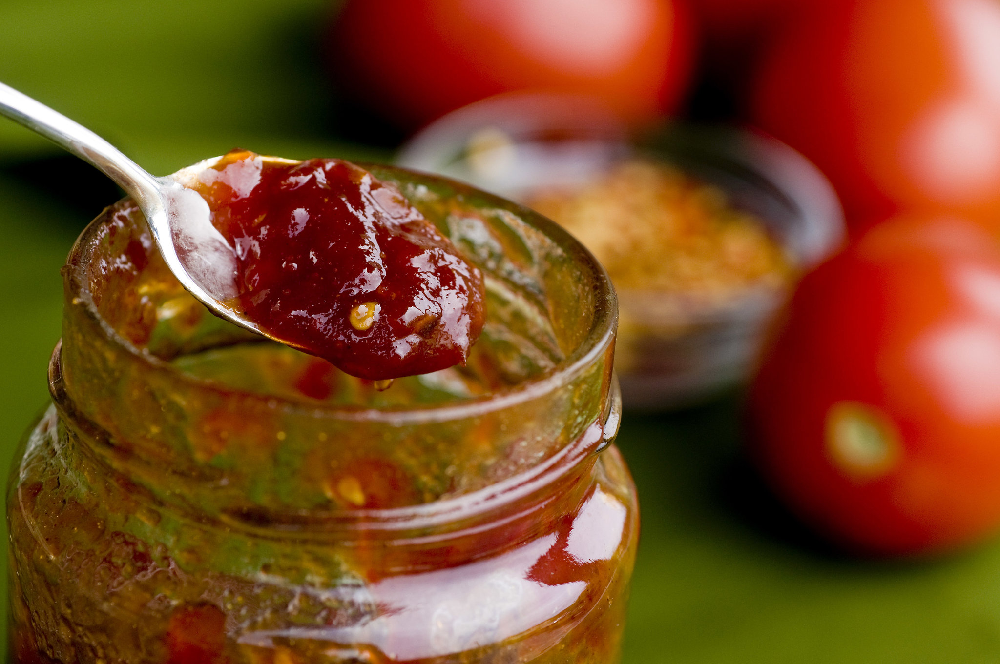

# Томатный джем

#### Ингредиенты

* Спелые томаты - 1 кг.
* Зубчики чеснока - 8 шт.
* Эспелетский перец - 0,5 ч.л.
* Рыбный соус - 60 мл.
* Белый сахар - 600 г.
* Красный винный уксус - 200мл.

#### Приготовление

Томаты помыть, срезать верхнюю часть с плодоножкой. Зубчики чеснока крупно нарезать. Половину томатов нарезать мелким кубиком, оставляя кожу и семена.  
В чаше стационарного блендера смешать оставшиеся томаты, чеснок, эспелетский перец, рыбный соус и пробить до однородного пюре. Перелить в глубокий сотейник, добавить сахар и уксус, перемешать до однородности. Медленно довести до кипения на среднем огне, постоянно помешивая.  
Уменьшить огонь до слабого и добавить оставшиеся нарезанные томаты. Оставить слабо кипеть 30-40 минут, удаляя пену, которая будет появляться на поверхности. Помешивать каждые 5 минут, соскребая все твердые частицы со дна и с боков, чтобы джем готовился равномерно.

На данном этапе очень важно терпение; если джем перегреется на сильном огне и карамелизируется, готовый цвет будет тусклым и темным, а не красивого ярко-красного цвета. Чтобы проверить джем на готовность, выложить небольшую ложку джема на холодную тарелку, если джем застыл и стал мягким и с него не стекает остаточная жидкость – джем готов. Если джем стал слишком густым, добавить немного воды и снять с огня.

Перелить джем в прогретые стерилизованные стеклянные банки и оставить остывать до комнатной температуры. Хранить в холодильнике до 4 недель.

*Tg:kolbasina_food*